# **[Linux (From Bilibili_HanShunping)(2020)](https://www.bilibili.com/video/BV1Sv411r7vd?spm_id_from=333.788.videopod.episodes&vd_source=78ee694443a555aba98b1b3b92b56605)**

------

## 课程简介

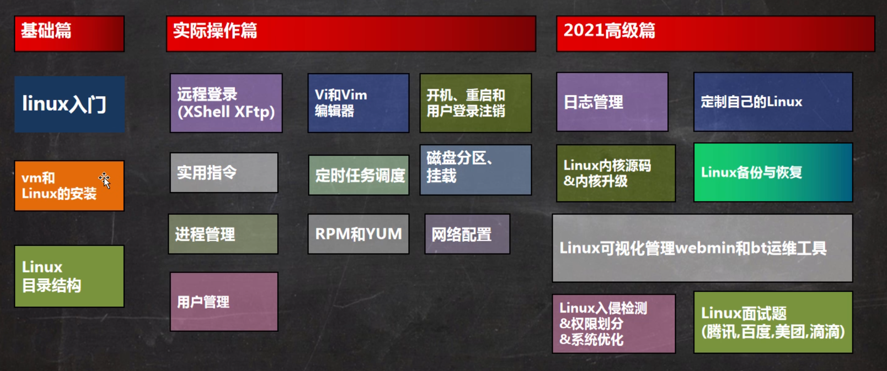

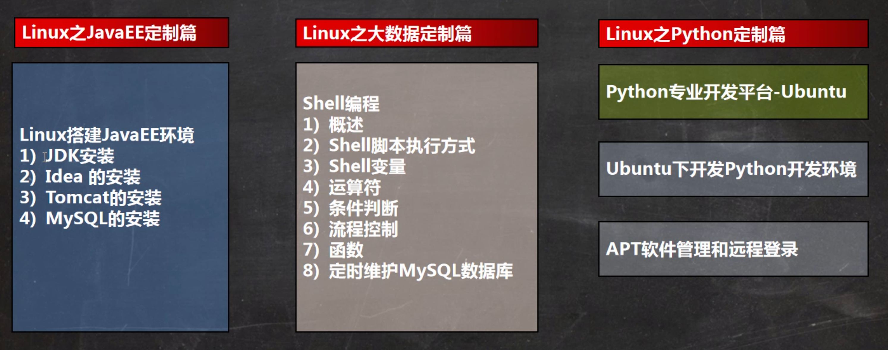

[韩顺平图解Linux课程资料链接](https://pan.baidu.com/s/1j0HVED0vIa7J211QX2UMRg) [提取码](shik)

[韩顺平图解Linux](图解Linux_hsp.pdf)

> [!NOTE]
>
> 写这篇笔记的时候使用的环境是Ubuntu20.04，和韩老师使用的CentOS7.6有些细微区别，但大多数Linux概念是相通的


------


## 1. Linux 应用领域

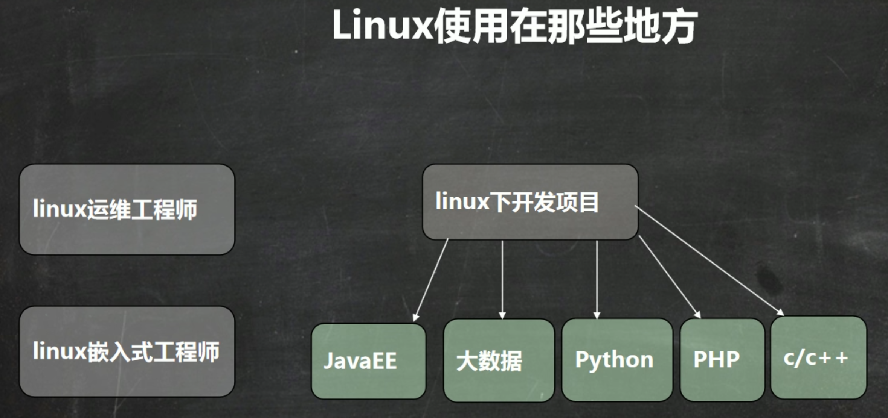

**面向工程师：**

- Linux运维工程师：服务器规划，调试优化，日常监控，故障处理，数据备份和恢复，日志的分析与管理
- Linux嵌入式工程师：驱动开发，在嵌入式系统中进行程序开发

**面向应用：**

- 个人桌面领域是传统 linux 应用薄弱的环节，近些年来随着 ubuntu、fedora 等优秀桌面环境的兴起，linux 在个人桌面领域的占有率在逐渐的提高。
- linux 在服务器领域的应用是最强的，linux 免费、稳定、高效等特点在这里得到了很好的体现，尤其在一些高端领域尤为广泛（c/c++/php/java/python/go）。
- linux 运行稳定、对网络的良好支持性、低成本，且可以根据需要进行软件裁剪，内核最小可以达到几百 KB 等特点， 使其近些年来在嵌入式领域的应用得到非常大的提高。主要应用：机顶盒、数字电视、网络电话、程控交换机、手机、PDA、智能家居、智能硬件等都是其应用领域，以后在物联网中应用会更加广泛。


------


## 2. Linux 入门

### 2.1 概述

​	Linux 是一个开源、免费的操作系统，其稳定性、安全性、处理多并发已经得到业界的认可，目前很多企业级的项目 (c / c++ / php / python / java / go)都会部署到 Linux/unix 系统上。常见的操作系统有：windows、IOS、Android、MacOS, Linux, Unix。

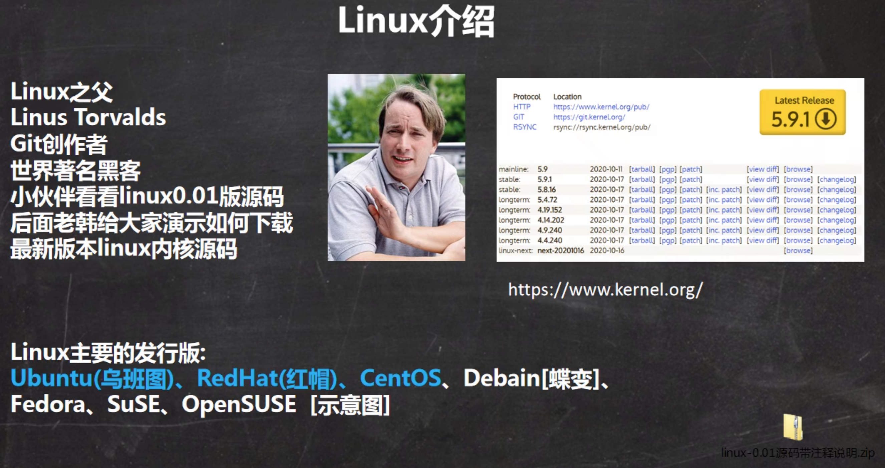

> [!NOTE]
>
> Linux只是一个内核（kernel），不提供上层的操作系统（OS，Operating System）甚至是桌面系统（Desktop System），所以Linux内核和Linux发行版的关系是：Linux发行版是基于开源的Linux内核开发的操作系统和桌面系统。更详细的讲解可以参考[视频](【【硬核科普】Linux根本不是操作系统？终于有人把“内核态”与“用户态”讲明白了！| 进程 / CPU特权模式 / 受限模式 / 系统调用】 https://www.bilibili.com/video/BV1o7PSzZEke/?share_source=copy_web&vd_source=8d1c06c5fb96d5f743cdb6f467e1cd82)，搬运自[视频](https://www.youtube.com/watch?v=ZmPIxfCggFw&t=45s)，下面提供一些图文以供理解：
>
> 首先确定一个概念：操作系统负责连接最上层的用户应用程序软件（Software）和最底层的硬件（Hardware），而内核就是操作系统中负责连接硬件的部分。然后我们继续：
>
> 1. CPU运行有两种模式：特权模式（privileged mode）和受限模式（restricted mode），分别对应两种空间：内核空间（kernel space）和用户空间（user space）；也就是说，用户进程（Process）想要干任何事情，都只能在用户空间向内核发起请求，然后才能由内核对硬件进行操作，显然这避免了众多用户进程直接操控内核这样危险的操作，保证系统安全。其中，系统调用接口是内核最接近用户程序的部分。
>
>    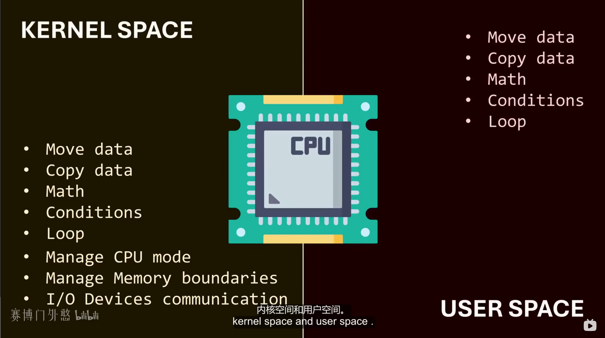
>
>    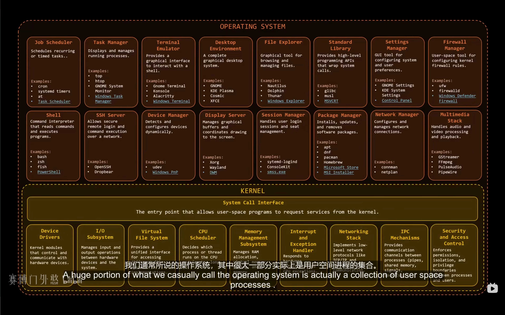
>
>    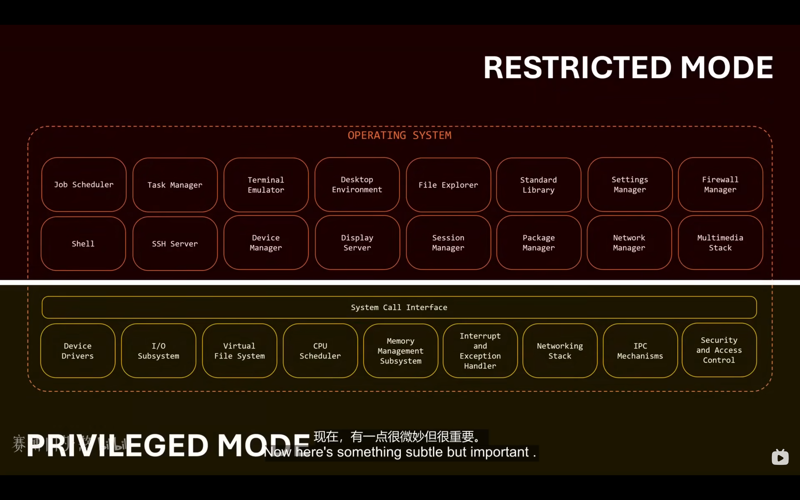
>
>    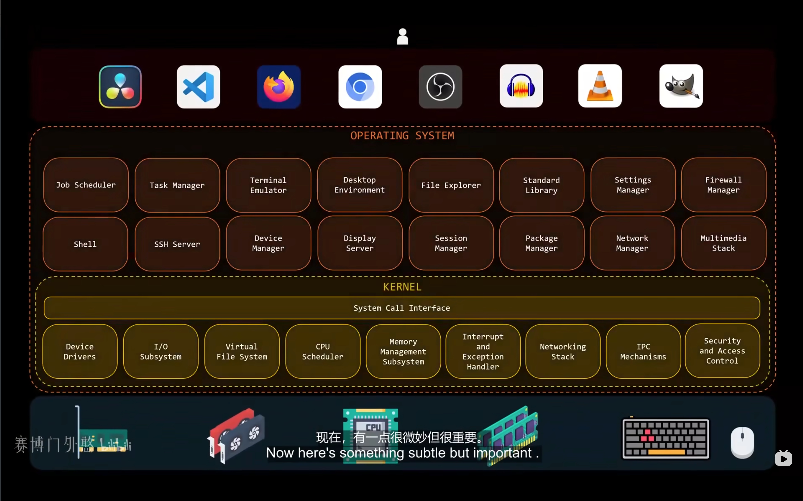
>
> 2. LInux的进程创建哲学是：进程必须先请求操作系统克隆它自己，然后克隆出来的进程再请求操作系统替换为它自己的程序。就是说，用户进程是由其他用户进程所创建的（有点像生物学中所有新细胞都来源于老细胞的生命哲学），意味这从一个子用户进程开始向其父进程开始递归追溯，就会发现所有进程都来自于一个根进程。
>
>    可以通过运行命令来查看进程树
>
>    ```bash
>    pstree
>    ```
>
>    所以，当我们打开电脑，在尝试以用户的身份执行任何操作前，内核的可执行代码必须被加载到内存中，这个过程被称之为引导（Bootstrapping），在所有关键组件加载完毕并准备就绪后，内核自身会初始化唯一一个用户进程，即初始进程（Init，pid=1)
>
>    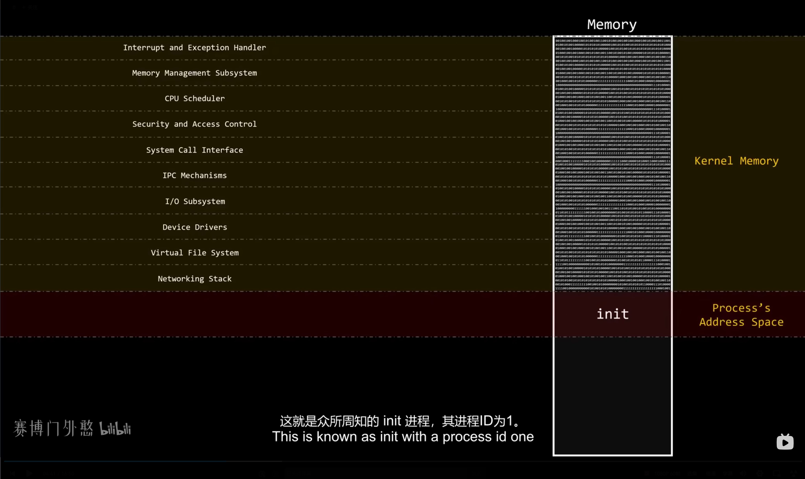
>
>    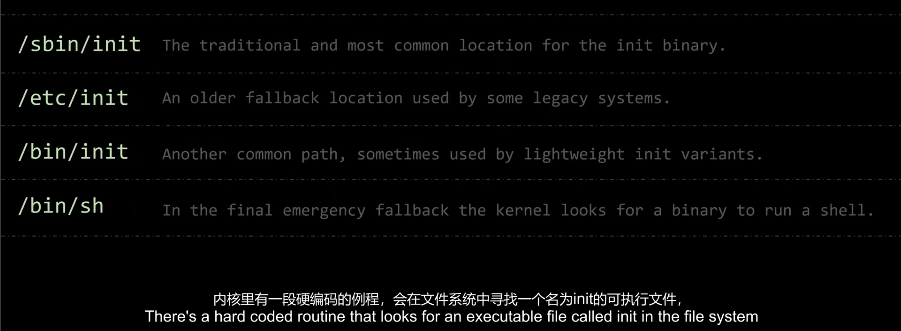
>
>    但事实上，内核设计者也不需要关心这个初始进程是怎样工作的。内核依然会运行可以可执行文件init，但是这个init实际会指向别处的文件来初始化进程，这就是发行版设计者需要关心的问题了，所以初始进程也不属于内核。初始化进程的设计哲学理念也有不同，目前主流的风格有SysVinit.c、OpenRC.c、runit.c、systemd.c，比如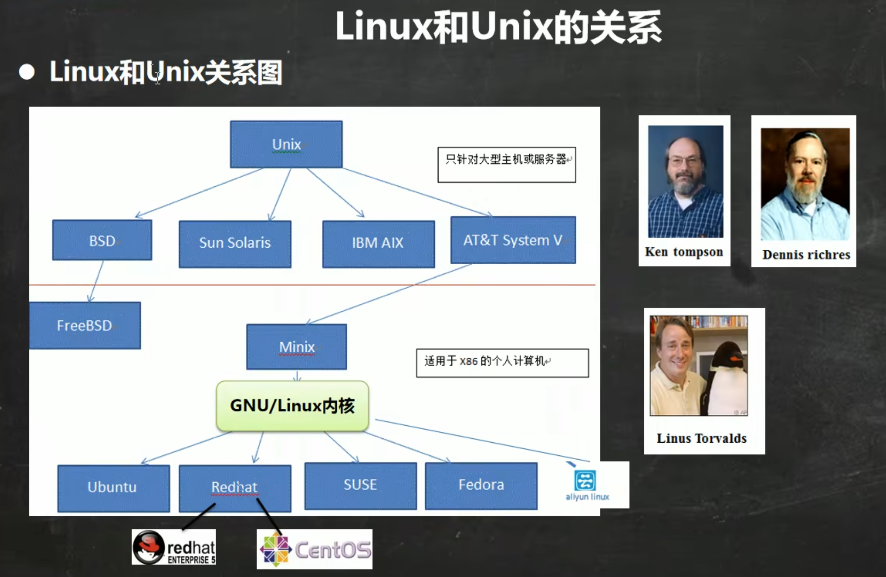Ubuntu：
>
>    ```bash
>    # 执行命令
>    cd /sbin
>    ls -l
>                         
>    # 可以发现init实际指向了systemd
>    lrwxrwxrwx 1 root root        20 6月  18  2024 init -> /lib/systemd/systemd
>    ```
>
>    对于内核来讲，初始进程是不被允许杀死的，所以许多初始进程的实现也被编写成一种恢复机制，用于恢复关键服务。

### 2.2 Linux 和 Unix 的关系

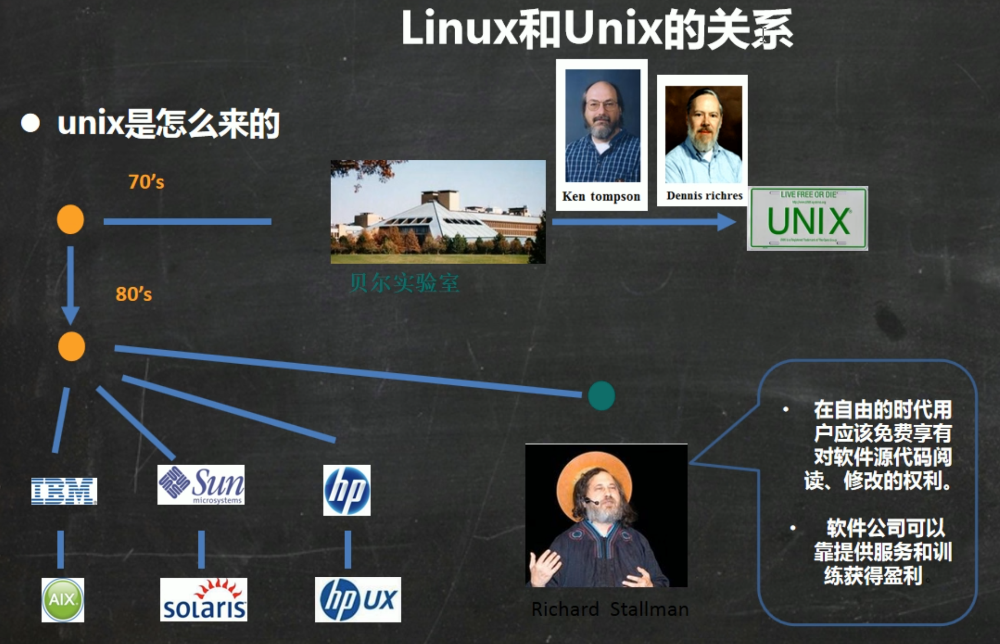

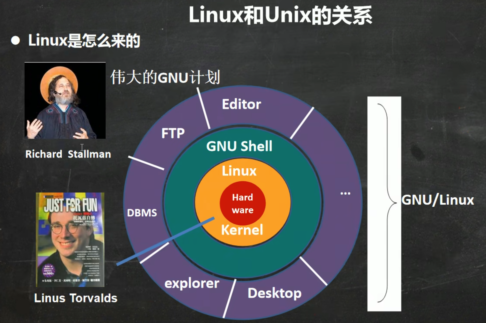


------


## 3. Linux 目录结构

###  3.1 基本结构

Linux 的文件系统是采用级层式的树状目录结构，在此结构中的最上层是根目录`/`，然后在此目录下再创建其他的目录。深刻理解 Linux 树状文件目录是非常重要的！记住 Linux 世界的一句至理名言：**“一切皆文件” (Everything is a file)**

### 3.2 具体目录结构

- `/bin`：（`/usr/bin` 、`/usr/local/bin`），`bin`是`Binary`（二进制文件） 的简称, 该目录为命令文件目录，也称为二进制目录。包含了供系统管理员及普通用户使用的重要的linux命令和二进制（可执行）文件，包含shell解释器等；

- `/sbin`：（`/usr/sbin`、`/usr/local/sbin`），`s` 就是 `Super User`（超级用户，也称系统管理员） 的意思，这里存放的是系统管理员使用的系统管理命令及其二进制（可执行）文件；

- `/home` ：该目录用于存放普通用户，永久挂载点。在 Linux 中每个用户都有一个自己的目录，一般该目录名是以用户的账号命名，`~`表示当前用户的宿主目录；

- `/root`：该目录为系统管理员，也称作超级权限者的用户主目录；

- `/lib`（`/usr/lib`、`/usr/local/lib`）：`library`的简称，该目录下存放了各种编程语言库，典型的Linux系统包含了C、C++和FORTRAN语言的库文件。是系统开机所需要最基本的动态连接共享库，其作用类似于 Windows 里的 DLL 文件。几乎所有的应用程序都需要用到这些共享库；

- `/lost+found`：该目录一般情况下是空的，当系统非法关机后，这里就存放了一些文件，在系统启动的过程中`fsck`工具会检查这里，并修复已经损坏的文件系统。有时系统发生问题，会有很多的文件被移到这个目录中，可能会用手工的方法来修复，或者移动文件到原来的位置上；

- `/etc`：源自法语`et cetera`（“等等”的意思），包含所有的系统管理所需要的配置文件和子目录；

- `/usr`：`user`的简称，这是一个非常重要的目录，用户的很多应用程序和文件都放在这个目录下，类似与 Windows 下的`program files` 目录；

- `/boot`：存放的是启动 Linux 时使用的一些核心文件，包括系统的内核文件和引导装载程序文件；

- `/proc`（不能动）：[`Process Information Pseudo Filesystem （进程信息伪文件系统）`](https://blog.csdn.net/sinat_26058371/article/details/86536314)，该目录是一个虚拟的目录，是系统内存的映射，提供一个指向内核数据结构的接口，通过它能够查看和改变各种系统属性；

- `/srv`（不能动）：`service`的简称，该目录用于存放系统提供的各种服务的数据。例如，Web 服务器的文件可以存放在 /srv/www 下，FTP 服务器的文件可以存放在 /srv/ftp 下。/srv 目录结构可以根据具体服务的需求进行自定义；

- `/sys`（不能动）：`system`的简称，该目录是 Linux 内核的 `sysfs` 文件系统的挂载点，用于呈现内核与设备驱动程序、硬件设备、内核模块之间的接口信息。该目录提供了一种统一的方式，让用户和系统管理员能够直接与系统硬件和内核交互。它是内核空间与用户空间之间的桥梁；

- `/tmp`：`temp`的简称，该目录是一个用于存储系统和用户应用程序临时数据的目录。这个目录中的文件通常在系统重启后会被自动清除，也可以通过命令手动清除；

- `/dev`：`device`的简称，该目录中包含了所有Linux系统中使用的外部设备，类似于 windows 的设备管理器，把所有的硬件用文件的形式存储，但是这里并不是放的外部设备的驱动程序，这一点和 Windows, DOS 操作系统不一样，它实际上是一个访问这些外部设备的端口；

- `/media`： 该目录存放自动挂载的硬件（载点都是由系统自动建立和删除的），Linux 系统会自动识别一些设备，例如 U 盘、光驱等等，当识别后，linux 会把识别的设备挂载到这个目录；

- `/mnt`：`mount`的简称，该目录是为了让用户临时挂载别的存储设备和文件系统，如硬盘、CD-ROM、USB 闪存驱动器等，或者远程文件系统（例如 NFS 文件共享）。当文件系统挂载到 /mnt 目录时，它会映射到 /mnt 下的一个子目录中，用户就可以通过这个子目录访问里面的内容；

- `/opt`：`optional`的简称，该目录是用于安装额外软件包的目录。它是由[`Filesystem Hierarchy Standard (FHS)`](https://en.wikipedia.org/wiki/Filesystem_Hierarchy_Standard)中定义的一种标准文件系统结构。用于放置可选的、独立于发行版的应用程序和软件包。这些软件包不需要使用系统的共享库，并且可以在整个系统中被多个用户使用。通常，这些软件包包含有自己的二进制文件、库、文档等；

- `/var`：`variable`的简称，该目录用于存储在系统运行过程中会动态变化的数据，其内容会随着系统运行、用户操作或应用活动而不断增长、修改或删除。例如，系统日志、Web 服务器文件、数据库数据、邮件队列等均存储于此；一、 什么是用户（User）—— 员工工牌

- `/usr/local`：该目录用于存放主机额外安装的软件，一般是通过编译源码方式安装的程序；

- `selinux`：`security-enhanced linux`的简称，这是一种安全子系统,它能控制程序只能访问特定文件, 有三种工作模式，可以自行设置。

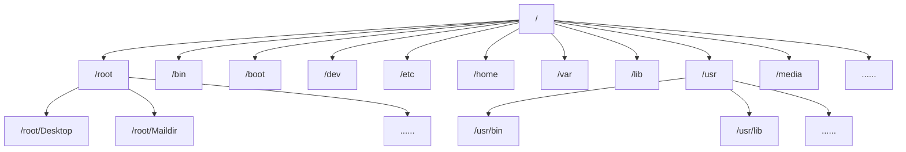

------


## 4. 远程登录到Linux服务器

此部分略，这里是用[`Xshell, Xftp6`](https://www.netsarang.com/en/free-for-home-school/)这两款软件实现的，但是现在有更好的远程连接实现方式[`vscode`](https://blog.csdn.net/weixin_42490414/article/details/117750075?ops_request_misc=elastic_search_misc&request_id=4fd45f43bc99df377855ba5c42231dbd&biz_id=0&utm_medium=distribute.pc_search_result.none-task-blog-2~all~ElasticSearch~search_v2-1-117750075-null-null.142^v102^pc_search_result_base8&utm_term=vscode%20linux%E8%BF%9C%E7%A8%8B&spm=1018.2226.3001.4187)


------


## 5. 使用Vim编辑器

### 5.1 基本介绍

Linux 系统会内置 vi 文本编辑器。 Vim 具有程序编辑的能力，可以看做是 Vi 的增强版本，可以主动的以字体颜色辨别语法的正确性，方便程序设计。代码补完、编译及错误跳转等方便编程的功能特别丰富，在程序员中被广泛使用。

### 5.2 Vim常用的三种模式

1. **正常模式**：以 vim 打开一个档案就直接进入一般模式了(这是默认的模式)。在这个模式中， 你可以使用『上下左右』按键来 移动光标，你可以使用『删除字符』或『删除整行』来处理档案内容， 也可以使用『复制、粘贴』来处理你的文件数据；
2. **插入模式**：按下 i, I, o, O, a, A, r, R 等任何一个字母之后才会进入编辑模式, 一般来说按 i 即可；
3. **命令行模式**：输入 esc 再输入：在这个模式当中， 可以提供你相关指令，完成读取、存盘、替换、离开 vim 、显 示行号等的动作则是在此模式中达成的；

### 5.3 各种模式的项目切换

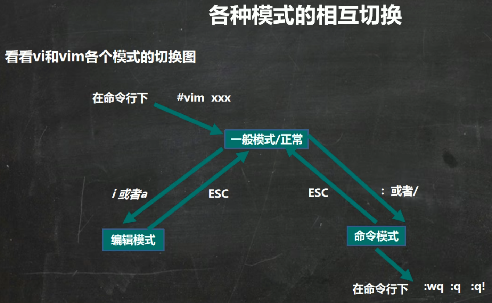

### [5.4 Vim的快捷键](./vim.md)

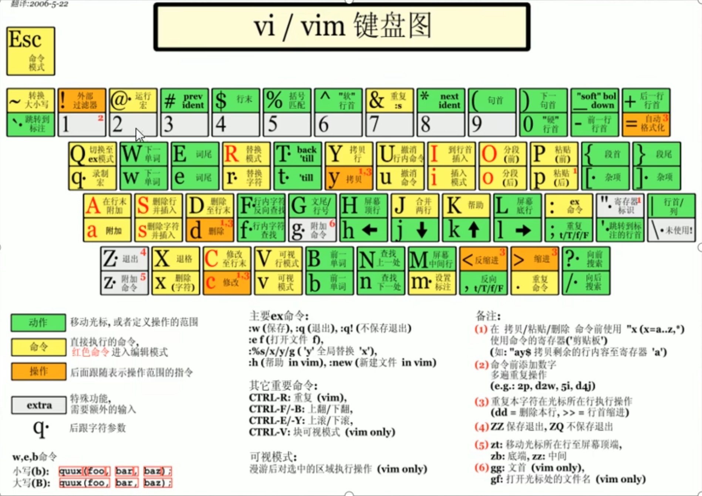


------


## 6. Linux  用户管理

用户和组相关文件：

- `/etc/passwd`：存放用户基本信息，格式：`root:x:0:0:root:/root:/bin/bash`，意思是：`用户名:密码占位符(x):UID:GID:描述:家目录:默认Shell`
- `/etc/shadow`：存放用户的真实密码（经过哈希加密）和密码过期时间，格式：`登录名:加密口令:最后一次修改时间:最小时间间隔:最大时间间隔:警告时间:不活动时间:失效时间:标志`
- `/etc/group`：存放用户组信息，格式：`组名:口令:组标识号:组内用户列表`

### 6.1 关机&重启命令：

```bash
# 立刻关机
shutdown -h now

# n分钟之后关机
shutdown -h n 

# 立即重启
shutdown -r now

# n分钟之后重启
shutdown -r n

# 关机
halt
poweroff

# 重启
reboot

# 把内存数据同步到磁盘（目前以上相关指令执行前都调用了sync）
sync
```

### 6.2 用户管理：

在解释 Linux 的“用户”和“用户组”概念时，我们可以把 Linux 操作系统想象成一栋**办公大楼（或者一家大公司）**。

因为 Linux 从诞生之初就是一个**多用户**的系统，它允许多个人同时登录并使用这台服务器。为了保证大家互不干扰，且机密文件不被乱看，就衍生出了“用户”和“组”的概念。

我们用“公司”的运作方式来理解它们：

#### 1.  什么是用户（User）—— 员工工牌

**用户，代表的是“身份（Identity）”**：它是系统用来识别“你是谁”以及“你能干什么”的唯一凭证。在 Linux 这家公司里，员工分为三种：

1. **超级管理员（Root） - UID 为 0**
   - **角色**：公司的最高董事长、大楼的超级物业
   - **特权**：拥有至高无上的权力（God Mode）。他可以无视任何规则，打开任何房间的门，查看或删除任何文件。**能力越大，破坏力越大**，所以日常不建议直接用 root 登录，容易“删库跑路”
2. **普通用户（Regular User） - UID 通常 1000 起步**
   - **角色**：普通的打工人（比如刚才你创建的 tom）
   - **特权**：他们有自己专属的工位和抽屉（**家目录 /home/tom**）。他们只能在自己的工位上折腾，或者访问大楼里的公共区域。如果想去改系统核心配置，系统会提示“权限拒绝（Permission denied）”
3. **系统用户（System User） - UID 通常在 1 ~ 999 之间****
   - **角色**：大楼里的“服务机器人”或“外包设备”
   - **特权**：你可能没注意，Linux 里自带了很多你从来没建过的用户，比如 www-data、mysql、sshd。它们是专门给软件（服务）准备的假人。比如 Nginx 网页服务默认以 www-data 身份运行，这样就算黑客攻破了网页，他也只是个普通打工人，拿不到董事长的权限。这是一种**安全隔离机制**。

#### 2. 什么是用户组（Group）—— 部门

**组，代表的是“角色（Role）”或“部门”。**
它的核心作用只有一个：**为了更方便地批量管理权限。**

**为什么需要组？**
假设公司有一个“财务报表”文件夹。如果没有组，你要把访问权限一个个地赋予张三、李四、王五……等50个财务人员。如果张三离职了，你还得专门去把他的权限删掉，极其麻烦。
**有了组以后：**
你只需要创建一个名叫 finance（财务部）的**用户组**，把这50个人拉进这个组，然后直接规定：“这个文件夹，只有 finance 组的人能看” ，以后谁入职/离职，只要把他加入/踢出这个组就行了。高效且优雅！

**关于组的两个核心概念（容易懵的点）：**

每个人可以同时属于多个部门，但在 Linux 里，组分为两种：

1. **主组（Primary Group / 初始组）**每个用户**必须且只能有一个**主组。当你用 adduser tom 创建用户时，Linux 默认会顺手建一个也叫 tom 的组，并把 tom 的主组设为 tom。**意义**：当 tom 新建了一个文件时，这个文件默认就属于 tom 组。
2. **附加组（Secondary Group / 附加组）**一个用户可以有**零个或多个**附加组。比如 tom 表现很好，老板决定给他系统管理的权限。我们就可以用之前提过的命令：adduser tom sudo（把 tom 加入 sudo 这个附加组）。此时 tom 既属于 tom 组，也属于 sudo 组（戴了两条部门袖标）。

#### 3. 相关命令

```bash
# 登录为系统管理员，Ubuntu 为 sudo -i
su - root

# 切换为指定普通用户
su - username
```

```bash
# 登出当前用户
exit 
logout
```

```bash
# 设置指定用户的密码
passwd username
```

```bash
# 设置指定用户的密码
passwd username

# 重置root用户密码，需要在root用户下执行
passed root
```

```bash
# 添加一个新用户在 /home ，也可以 useradd -d 指定目录 username 指定新用户的家目录
useradd username

# 强烈建议新手使用这个！这是一个基于 useradd 的高级脚本（多见于Debian/Ubuntu系列）。它是交互式的，运行后会一步步问你设置密码、全名、电话等，并自动帮你建好Home目录
adduser username
```

```bash
# 仅删除用户
userdel username

# 删除用户和 /home 下的用户目录
userdel -r username
```

```bash
# 添加一个组
groupadd groupname

# 删除一个组
groupdel groupname

# 新增一个用户到指定组
useradd -g groupname username

# 将一个用户添加到指定组
usermod -g groupname username

# Ubuntu/Debian下的常用法，把用户加入到某个附加组并授予 sudo 权限
usermod -aG sudo username
```

```bash
# 查询用户信息
id root
id username

# 只打印当前你的有效用户名
whoami

# 查看当前有哪些用户登录了这台服务器，以及他们是从哪个IP连过来的
who

# 强烈推荐!不仅能看谁在线，还能看到系统的负载（Load Average），以及每个用户正在执行什么命令
w
```


------


## 7. Linux 实用指令

### 7.1 指定运行级别

在 Linux 中，**运行级别（Runlevel）** 决定了系统启动后进入的**工作模式**或**状态**。

为了方便理解，你可以把它想象成 Windows 的**“安全模式”**与**“正常启动”**，或者是汽车的**“档位”**。在不同的档位（运行级别）下，系统启动的服务、挂载的硬件和提供的功能是完全不同的。

了解运行级别非常重要，尤其是在排查故障、节省服务器资源或者破解密码时。

#### 1.  经典的 7 个运行级别（SysVinit 时代）

在传统的 Linux 系统中，运行级别被严格定义为 **0 到 6** 共 7 个数字。虽然现在底层技术变了，但这 7 个数字的概念依然被保留和通用：

- **`0`：关机（Halt）**：系统停机状态。千万别把默认运行级别设为 `0`，否则电脑一开机就会立刻关机
- **`1`：单用户模式（Single user mode）**：类似 Windows 的“带命令提示符的安全模式”。不需要输入密码就能直接进入 root 权限，没有网络，只挂载基本的文件系统。**作用**：主要用于系统维护、修复损坏的文件系统，或者**忘记 root 密码时进来强行改密码**
- **`2`：多用户模式（没有 NFS 网络文件系统）**：比较少用，和 `3` 差不多，只是少了一些网络功能
- **`3`：完全多用户文本模式（Multi-user text mode）**：**核心重点！这是所有 Linux 服务器的默认状态。**系统启动所有的网络和服务，允许多个用户同时登录，但是**没有图形界面（纯黑底白字的命令行）**。最省内存、最稳定
- **`4`：保留，未使用**：留给用户自己定制的级别
- **`5`：图形化多用户模式（Graphical mode）**：**核心重点！这是所有 Linux 桌面版（比如你装了桌面的 Ubuntu）的默认状态。**在级别 `3` 的基础上，多启动了一个 GUI 图形系统（如 `X11/Wayland`），你可以用鼠标操作
- **`6`：重启（Reboot）**：正常重启系统。同样千万不能设为默认，否则机器会无限循环重启

#### 2. 现代 Linux 的演进：Target（systemd 时代）

​	现代的 Linux 发行版（Ubuntu 16.04+、CentOS 7+ 等）早就淘汰了老旧的 `SysVinit `启动程序，换成了更先进的 **`systemd`**。在 `systemd` 中，不再使用“运行级别（runlevel）”这个词，而是改成了 **“目标（Target）”**。不过为了照顾老用户的习惯，数字和单词是对应起来的：

- **运行级别 `3`** 变成了 👉 **`multi-user.target`** （多用户命令行目标）
- **运行级别 `5`** 变成了 👉 **`graphical.target`** （图形化目标）
- **运行级别 `1`** 变成了 👉 **`rescue.target`** （救援目标）

#### 3.  怎么查看和切换运行级别？

你可以随时在你的 Ubuntu 上敲这些命令来体验：

> [!WARNING]
>
> 切换级别可能会导致当前图形界面消失，如果是云服务器则无所谓

1. 查看当前的运行级别

   - **老方法**：

     ```bash
     runlevel
     ```

   - **新方法（推荐）**：

     ```bash
     systemctl get-default
     ```

2. 临时切换运行级别（立即生效，重启后失效）

   假设你在用带桌面的 Ubuntu，觉得太卡了，想临时关掉桌面，变成纯命令行：

   - **老方法**：

     ```bash
     init 3
     ```

   - **新方法**：

     ```bash
     sudo systemctl isolate multi-user.target
     ```

   想再回到图形界面：

   - **老方法**：

     ```bash
     init 5
     ```

   - **新方法**：

     ```bash
     sudo systemctl isolate graphical.target
     ```

3. 永久修改默认运行级别（重启后依然生效）

   假设你装了一台带桌面的 Ubuntu 服务器，但你以后只想把它当纯服务器用，不想浪费内存去加载桌面：

   - **设置默认开机进命令行**：

     ```bash
     sudo systemctl set-default multi-user.target
     ```

   - **设置默认开机进图形界面**：

     ```bash
     sudo systemctl set-default graphical.target
     ```

> [!NOTE]
>
> **一个有意思的问题：在Ubuntu如何找回root密码？**
>
> 在 Ubuntu（以及绝大多数 Linux 发行版）中找回或重置遗忘的 root 密码，其实就是利用了我们提到的 **单用户模式（或者叫救援模式）**
>
> 这个过程看起来非常像“黑客操作”，但它是系统管理员的必备技能
>
> ⚠️ **先决条件**：你必须拥有这台机器的**物理接触权限**（如果是云服务器或虚拟机，你需要能打开提供商的 **VNC 控制台 / 网页终端**）。只要别人摸不到你的电脑，这个机制就不会带来安全问题；但如果物理机被别人拿到了，他也能用同样的方法改你的密码（除非你加密了硬盘）
>
> 接下来是具体步骤，**建议你先整体看一遍，再实际操作**：
>
> ### 方法：通过修改 GRUB 引导参数直接拿 Shell（最通用、必杀技）
>
> 这个方法跳过了正常的系统启动过程，直接让 Linux 内核丢给你一个具有最高权限的命令行
>
> #### 第 1 步：进入 GRUB 启动菜单
>
> 1. 重启你的 Ubuntu
> 2. 在电脑刚开机、出现主板 Logo 后，**立刻一直按住 `Shift` 键**（在某些系统或虚拟机中是狂按 **`Esc 键`**）
> 3. 成功的话，你会看到一个黑底白字（或紫底白字）的菜单，第一项通常写着 `Ubuntu`，第二项写着 `Advanced options for Ubuntu`
>
> #### 第 2 步：进入编辑模式
>
> 1. 用键盘上下键，停留在第一项 **`Ubuntu`** 上
> 2. 按下键盘上的字母 **`e`**（Edit 的意思）
> 3. 此时屏幕会变成一堆密密麻麻的英文，这是系统启动的配置代码
>
> #### 第 3 步：修改内核启动参数（核心魔法）
>
> 1. 用键盘的上下左右方向键往下找，找到以单词 **`linux`** 开头的那一行（这行通常很长，可能会自动换行）
>
> 2. 在这一行里面，仔细找，找到 **`ro`** 这个词（它的意思是 Read-Only，只读）
>
> 3. 把光标移过去，**把 `ro` 删除掉**，替换成：
>
>    ```text
>    rw init=/bin/bash
>    ```
>
>    (💡 原理：`rw` 让硬盘变得可读可写，`init=/bin/bash` 告诉内核：不要去加载那个复杂的 `systemd` 系统了，直接给我运行一个 bash 终端！)
>
> #### 第 4 步：启动并重置密码
>
> 1. 修改完成后，仔细检查一下有没有拼错
>
> 2. 按下 **`Ctrl + X`** 或者 **`F10`** 保存并启动
>
> 3. 几秒钟后，屏幕上不会出现正常的登录界面，而是直接出现一个纯黑的命令行提示符，大概长这样：`root@(none):/#`
>    **恭喜你，你现在已经是全能的 root 身份了！**
>
> 4. 输入重置密码的命令：
>
>    ```bash
>    passwd root
>    ```
>
>    (如果你想改的是你自己的普通用户密码，比如你之前建的 tom，就输入 passwd tom)
>
> 5. 按照提示输入新密码两次（记住，**输入密码时屏幕依然没有任何显示**，盲打完按回车即可），如果看到 password updated successfully，就说明成功了
>
> #### 第 5 步：安全重启
>
> 因为我们破坏了正常的启动流程，直接用 reboot 命令可能会报错。我们需要强制重启：
>
> 1. 先同步一下数据到硬盘，防止丢失：
>
>    ```bash
>    sync
>    ```
>
> 2. 强制重启系统：
>
>    ```bash
>    exec /sbin/init
>    ```
>
>    (如果这条命令没反应，你也可以直接长按电脑电源键强制关机再开机，因为刚才已经 sync 过了，数据是安全的)
>
> ### 💡 补充：Ubuntu 独有的“傻瓜式”恢复模式
>
> Ubuntu 其实提供了一个稍微简单的界面，但有时不太灵验（如果你之前给 root 设过密码，它可能依然会卡住要你输入密码），可以作为了解：
>
> 1. 同样进入 GRUB 菜单。
>
> 2. 选择 `Advanced options for Ubuntu`，回车。
>
> 3. 选择 `recovery mode`，回车。
>
> 4. 等一会儿，会跳出一个蓝底灰框的菜单，用方向键选择 **`root - Drop to root shell prompt`**，回车。
>
> 5. 此时如果在下面弹出了光标，你就可以直接输入 passwd root 改密码了。但在这个模式下硬盘默认是只读的，在改密码前需要先敲一行代码重新挂载硬盘：
>
>    ```
>    mount -o remount,rw /
>    ```
>
> **总结**：rw init=/bin/bash 是 Linux 界非常经典的救命绝招，不论是 CentOS、Debian 还是 Ubuntu 都通用。

### 7.2 帮助指令

在 Linux 世界里有一句名言：“***不要试图记住所有的命令和参数，只要记住怎么查帮助就行了***”

Linux 的命令成千上万，每个命令又有几十个参数，连内核大神都不可能全记住。熟练使用“帮助指令”，是你从“新手”走向“老鸟”的最关键一步

 Linux 的帮助体系分为**“四大神器”**和一个**“现代外挂”**，从简到繁：

#### 1. 最快捷的备忘录：`--help` 参数

当你大致记得一个命令，但忘了具体参数（比如不知道怎么按时间排序 ls），这是首选

- **用法**：在几乎所有的外部命令后面加上 `--help` 或 `-h`

- **示例**：

  ```bash
  ls --help
  ```

- **特点**：它会直接在终端里吐出一堆说明，告诉你这个命令怎么用、有哪些参数。简单直接，看完就能继续敲命令

#### 2. 最权威的百科全书：man (Manual)

`man` 是 Linux 系统自带的“官方说明书”。如果 `--help` 只是小抄，那 `man` 就是厚厚的字典

- **用法**：`man 命令名字`

- **示例**：

  ```bash
  man useradd
  ```

- **⚠️ 必杀技：如何阅读和退出 `man`（非常重要）**
  很多新手第一次进入 `man` 界面后，会发现按回车没反应，按 `Ctrl+C` 也退不出来，最后只能关闭终端。其实它用的是 `less` 阅读器，你只需要记住这几个按键：**空格键 (Space)**：向下翻一页。**`b`**：向上翻一页（back）。**`/关键字`**：向下搜索某个词（比如你想查 `password`，就输入 `/password `然后回车。按 `n` 找下一个，按 `N` 找上一个）。**`q`**：**退出（Quit）！**（随时按下 `q` 就能回到普通命令行）

#### 3. 专属内部命令的帮助：`help`

这里有一个**经典的坑**：如果你输入 `cd --help` 或者 `man cd`，你会发现系统报错或者给出的不是你想要的结果

- **原理补充**：Linux 的命令分为**“外部命令”**（存在硬盘上的小程序，比如 `ls`,` useradd`）和**“内部命令”**（Shell 程序自带的，比如 `cd`, `echo`）

- **解决办法**：对于 `cd` 这种内部命令，你要把 `help` 放在前面。

- **示例**：

  ```bash
  help cd
  ```

#### 4. “我忘了命令叫啥”：`apropos` 和 `whatis`

有时你只记得想干什么，但不记得命令的名字了

1. **`whatis`（这是啥？）**：
   如果你看到一个陌生的命令，不想看长篇大论，只想知道它一句话的功能介绍

   ```bash
   whatis usermod
   # 输出：usermod (8) - modify a user account
   ```

2. **`apropos`（关于某事）**：
   如果你想**搜索功能**。比如你想修改密码，但忘了命令是啥（只记得关键词 `password`）

   ```bash
   apropos password
   # 它会列出所有说明书里带有 password 字眼的命令，你一眼就能发现 passwd 在里面
   ```

#### 🌟 5. 现代开发者的终极外挂：`tldr` (强烈推荐！)

`man` 手册虽然权威，但太长了，全是大段的英文，有时候让人抓狂
于是开源社区发明了一个神器叫 **`tldr`**，它的全称是网络流行语 **Too Long; Didn't Read（太长不看）**

- **功能**：你查一个命令，它**只给你展示日常工作中最常用的 5 个例子**，简单粗暴！

- **安装（Ubuntu）**：

  ```bash
  sudo apt update
  sudo apt install tldr
  ```

- **使用**：

  ```bash
  tldr tar
  ```

  它不会给你看长篇大论，而是直接告诉你：

  - 怎么解压一个文件
  - 怎么压缩一个文件
  - 怎么查看压缩包内容

#### 总结与实操建议

遇到不会的命令，最佳的流程是：

1. 先用 **`tldr` ** 看看有没有现成的例子直接抄
2. 没有的话，用 **`--help`** 扫一眼参数
3. 遇到极其复杂的配置（比如修改网络、写定时任务），再用 **`man` ** 仔细研读

你现在可以试着在你的 Ubuntu 上敲一下 `man ls`，练习一下按下` / `搜索关键词，然后按`q `退出，体会一下这种“阅读文档”的感觉

掌握了查帮助的方法，你就具备了自学 Linux 的能力！

### 7.3 文件目录类指令

为了方便记忆,，按**实际工作中的使用场景**分为了五大类，并且为你补充了最实用的参数和**“避坑指南”**

#### 1. 穿梭与观察（“我在哪、去哪里、有什么”）

1. `pwd` (Print Working Directory - 打印工作目录)
   *   **作用**：查看当前你正处于哪个文件夹下
   *   **用法**：直接敲 `pwd`
   *   **实战提示**：当你迷失在深深的目录层级中，或者要写绝对路径的脚本时，先用它确认一下位置

2. `cd` (Change Directory - 切换目录)
   *   **作用**：进入或退出文件夹。
   *   **神级快捷键**：
       *   `cd ~` 或直接 `cd`：瞬间回到你自己的家目录（比如 `/home/tom`）
       *   `cd ..`：返回上一级目录
       *   **`cd -`**：在最近待过的两个目录之间来回切换（类似电视遥控器的“返回”键，超级实用！）

3. `ls` (List - 列出内容)
   *   **作用**：看看当前文件夹里都有什么。
   *   **高频参数组合（必背）**：
       *   `ls -l`：列表模式，显示权限、拥有者、大小、时间等详细信息（很多系统自带简写命令 `ll`，等同于 `ls -l`）
       *   `ls -a`：显示所有文件（包括以 `.` 开头的**隐藏文件**）
       *   `ls -lh`：加了 `-h` (human-readable)，把文件大小从字节变成 KB、MB、GB，让人能看懂。
       *   **终极组合**：`ls -lah`（显示一切，且大小易读）

#### 2. 创造与毁灭（“新建与删除”）

1. `mkdir` (Make Directory - 创建目录)
   *   **作用**：新建一个文件夹
   *   **必学参数**：**`-p`** (parents)，如果你想创建一个多层级的目录 `mkdir a/b/c`，如果 `a` 和 `b` 不存在系统会报错，加上 `-p`（`mkdir -p a/b/c`），系统会连带父目录一起顺手建好

2. `touch` (摸一下)

   - **作用**：新建一个空文件（可以指定文件名后缀）

   *   **用法**：`touch 1.txt`
   *   **隐藏原理**：其实 `touch` 原本的作用是“修改文件的时间戳”，如果文件已存在，你 touch 它一下，它的内容不会变，但它的“最后修改时间”会变成现在。如果不存在，才顺手建个空的

3. `rm` (Remove - 删除)
   *   **作用**：删除文件或目录，**Linux 没有回收站，删了就是永远消失！**
   *   **高频参数**：
       *   删除文件：`rm file.txt`。
       *   删除文件夹：必须加 **`-r`** (recursive 递归)，`rm -r 文件夹名`
       *   强制删除不提示：加 `-f` (force)
       *   **最危险的命令**：`rm -rf /*`（无脑静默删掉系统根目录下的所有东西，即著名的“删库跑路”）

#### 3. 搬运与复制

1. `cp` (Copy - 复制)
   *   **作用**：复制文件或目录
   *   **用法**：`cp 源文件 目标位置`（例如 `cp a.txt /home/tom/`）
   *   **避坑**：复制文件夹时，和 `rm` 一样，**必须加上 `-r` 参数**，否则系统会跳过文件夹报错：`cp -r dir1 dir2`
   *   **实战小技巧**：备份配置文件时常用的手速操作：`cp nginx.conf nginx.conf.bak`

2. `mv` (Move - 移动 / 重命名)

   **作用**：有两种用法

   *   **移动文件**：把文件移到另一个文件夹（`mv 1.txt /tmp/`）
   *   **重命名**：如果在同一个目录下移动，就变成了重命名（`mv old.txt new.txt`）

#### 4. 偷窥与阅读（“查看文件内容”）

1. `cat` (Concatenate - 全文查看)
   *   **作用**：一口气把文件所有内容全吐在屏幕上
   *   **适用场景**：只适合看**小文件**。如果用它看几十万行的日志，你的屏幕会疯狂滚动到停不下来
   *   **实用参数**：`-n`（显示行号）

2. `more` (分页查看 - 老派)
   *   **作用**：一页一页看文件。按空格键翻下一页，按 Enter 翻下一行
   *   **缺点**：只能往下看，不能往回翻。已经被 `less` 淘汰

3. `less` (分页查看 - 现代)
   *   **作用**：功能强大的阅读器（我们前面学的 `man` 手册底层用的就是 `less`）
   *   **用法**：可以使用上下键翻动，用 `/` 搜索。按 `q` 退出
   *   **俗语**：“less is more” （less 功能比 more 强大）。对于大文件，首选 `less`，因为它不会像 `cat` 那样一次性把文件全读进内存，打开极快

4. `head` (看头部)
   *   **作用**：只看文件的前几行（默认前 10 行）
   *   **参数**：`head -n 5 1.txt`（只看前 5 行）

5. `tail` (看尾巴 - 极其重要！)
   *   **作用**：只看文件的最后几行（默认后 10 行）
   *   **🌟 灵魂参数**：**`-f`** (follow)
       *   `tail -f xxx.log`：这会一直盯住这个文件。一旦有新的程序往日志里写东西，屏幕上会**实时滚动更新**。这是运维和后端开发每天必用的命令（按 `Ctrl+C` 退出盯着）

#### 5. 进阶与杂项

1. `echo` (回声/打印)
   *   **作用**：你给它什么，它就在屏幕上输出什么（`echo "Hello"`）
   *   **实战意义（重定向）**：它本身没啥用，但配合 **`>` (覆盖)** 或 **`>>` (追加)** 符号就无敌了
       *   `echo "hello" > 1.txt`：直接把 hello 写入文件（原来内容被清空覆盖）
       *   `echo "world" >> 1.txt`：把 world 追加到文件末尾。这是最快的写文件方式，不用打开编辑器

2. `ln` (Link - 链接)
   *   **作用**：创建文件的快捷方式。分硬链接和软链接，这里只记实战中最有用的**软链接（类似 Windows 快捷方式）**
   *   **用法**：加 **`-s`** (symbolic) 参数
       *   `ln -s /真实的/深层/路径/目标文件 /桌面的快捷方式名`
       *   比如：`ln -s /var/log/nginx/access.log ~/web_log`。以后你直接看 `web_log`，其实就是在看真实的日志

3. `history` (历史记录)
   *   **作用**：查看你敲过的所有历史命令
   *   **神级用法**：
       1.  敲 `history` 看到带编号的列表，比如 105 行是刚才敲的长命令。直接输入 **`!105`** 回车，就能重新执行那条命令
       2.  键盘按下 **`Ctrl + R`**：进入历史命令搜索模式。只要输入几个字母，它就会自动补全你之前敲过的命令，极大地节省敲击键盘的时间！

