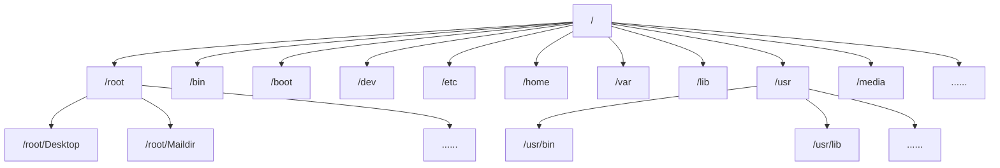

# Linux (From Bilibili_HanShunping)(2020)

## 课程简介


[韩顺平图解Linux课程资料链接](https://pan.baidu.com/s/1j0HVED0vIa7J211QX2UMRg) [提取码](shik)

## 1. Linux 应用领域


**面向工程师：**

- Linux运维工程师：服务器规划，调试优化，日常监控，故障处理，数据备份和恢复，日志的分析与管理
- Linux嵌入式工程师：驱动开发，在嵌入式系统中进行程序开发

**面向应用：**

- 个人桌面领域是传统 linux 应用薄弱的环节，近些年来随着 ubuntu、fedora 等优秀桌面环境的兴起，linux 在个人桌面领域的占有率在逐渐的提高。
- linux 在服务器领域的应用是最强的，linux 免费、稳定、高效等特点在这里得到了很好的体现，尤其在一些高端领域尤为广泛（c/c++/php/java/python/go）。
- linux 运行稳定、对网络的良好支持性、低成本，且可以根据需要进行软件裁剪，内核最小可以达到几百 KB 等特点， 使其近些年来在嵌入式领域的应用得到非常大的提高。主要应用：机顶盒、数字电视、网络电话、程控交换机、手机、PDA、智能家居、智能硬件等都是其应用领域，以后在物联网中应用会更加广泛。

## 2. Linux 入门

### 2.1 概述

​	Linux 是一个开源、免费的操作系统，其稳定性、安全性、处理多并发已经得到业界的认可，目前很多企业级的项目 (c / c++ / php / python / java / go)都会部署到 Linux/unix 系统上。常见的操作系统有：windows、IOS、Android、MacOS, Linux, Unix。


> [!NOTE]
>
> Linux只是一个内核（kernel），不提供上层的操作系统（OS，Operating System）甚至是桌面系统（Desktop System），所以Linux内核和Linux发行版的关系是：Linux发行版是基于开源的Linux内核开发的操作系统和桌面系统。更详细的讲解可以参考[视频](【【硬核科普】Linux根本不是操作系统？终于有人把“内核态”与“用户态”讲明白了！| 进程 / CPU特权模式 / 受限模式 / 系统调用】 https://www.bilibili.com/video/BV1o7PSzZEke/?share_source=copy_web&vd_source=8d1c06c5fb96d5f743cdb6f467e1cd82)，搬运自[视频](https://www.youtube.com/watch?v=ZmPIxfCggFw&t=45s)，下面提供一些图文以供理解：
>
> 首先确定一个概念：操作系统负责连接最上层的用户应用程序软件（Software）和最底层的硬件（Hardware），而内核就是操作系统中负责连接硬件的部分。然后我们继续：
>
> 1. CPU运行有两种模式：特权模式（privileged mode）和受限模式（restricted mode），分别对应两种空间：内核空间（kernel space）和用户空间（user space）；也就是说，用户进程（Process）想要干任何事情，都只能在用户空间向内核发起请求，然后才能由内核对硬件进行操作，显然这避免了众多用户进程直接操控内核这样危险的操作，保证系统安全。其中，系统调用接口是内核最接近用户程序的部分。
>
>    
>
>    
>
>    
>
>    
>
> 2. LInux的进程创建哲学是：进程必须先请求操作系统克隆它自己，然后克隆出来的进程再请求操作系统替换为它自己的程序。就是说，用户进程是由其他用户进程所创建的（有点像生物学中所有新细胞都来源于老细胞的生命哲学），意味这从一个子用户进程开始向其父进程开始递归追溯，就会发现所有进程都来自于一个根进程。
>
>    可以通过运行命令来查看进程树
>
>    ```bash
>    pstree
>    ```
>
>    所以，当我们打开电脑，在尝试以用户的身份执行任何操作前，内核的可执行代码必须被加载到内存中，这个过程被称之为引导（Bootstrapping），在所有关键组件加载完毕并准备就绪后，内核自身会初始化唯一一个用户进程，即初始进程（Init，pid=1)
>
>    
>
>    
>
>    但事实上，内核设计者也不需要关心这个初始进程是怎样工作的。内核依然会运行可以可执行文件init，但是这个init实际会指向别处的文件来初始化进程，这就是发行版设计者需要关心的问题了，所以初始进程也不属于内核。初始化进程的设计哲学理念也有不同，目前主流的风格有SysVinit.c、OpenRC.c、runit.c、systemd.c，比如Ubuntu：
>
>    ```bash
>    # 执行命令
>    cd /sbin
>    ls -l
>    
>    # 可以发现init实际指向了systemd
>    lrwxrwxrwx 1 root root        20 6月  18  2024 init -> /lib/systemd/systemd
>    ```
>
>    对于内核来讲，初始进程是不被允许杀死的，所以许多初始进程的实现也被编写成一种恢复机制，用于恢复关键服务。

### 2.2 Linux 和 Unix 的关系


## 3. Linux目录结构

###  3.1 基本结构

​	Linux 的文件系统是采用级层式的树状目录结构，在此结构中的最上层是根目录`/`，然后在此目录下再创建其他的目录。深刻理解 Linux 树状文件目录是非常重要的！记住一句经典的话：在 Linux 世界里，一切皆文件！

### 3.2 具体目录结构

1) `/bin`：（`/usr/bin` 、`/usr/local/bin`），`bin`是`Binary`（二进制文件） 的简称, 该目录为命令文件目录，也称为二进制目录。包含了供系统管理员及普通用户使用的重要的linux命令和二进制（可执行）文件，包含shell解释器等；
2) `/sbin`：（`/usr/sbin`、`/usr/local/sbin`），`s` 就是 `Super User`（超级用户，也称系统管理员） 的意思，这里存放的是系统管理员使用的系统管理命令及其二进制（可执行）文件；
3) `/home` ：该目录用于存放普通用户，永久挂载点。在 Linux 中每个用户都有一个自己的目录，一般该目录名是以用户的账号命名，`~`表示当前用户的宿主目录；
4) `/root`：该目录为系统管理员，也称作超级权限者的用户主目录；
5) `/lib`（`/usr/lib`、`/usr/local/lib`）：`library`的简称，该目录下存放了各种编程语言库，典型的Linux系统包含了C、C++和FORTRAN语言的库文件。是系统开机所需要最基本的动态连接共享库，其作用类似于 Windows 里的 DLL 文件。几乎所有的应用程序都需要用到这些共享库；
6) `/lost+found`：该目录一般情况下是空的，当系统非法关机后，这里就存放了一些文件，在系统启动的过程中`fsck`工具会检查这里，并修复已经损坏的文件系统。有时系统发生问题，会有很多的文件被移到这个目录中，可能会用手工的方法来修复，或者移动文件到原来的位置上；
7) `/etc`：源自法语`et cetera`（“等等”的意思），包含所有的系统管理所需要的配置文件和子目录；
8) `/usr`：`user`的简称，这是一个非常重要的目录，用户的很多应用程序和文件都放在这个目录下，类似与 Windows 下的`program files` 目录；
9) `/boot`：存放的是启动 Linux 时使用的一些核心文件，包括系统的内核文件和引导装载程序文件；
10) `/proc`（不能动）：[`Process Information Pseudo Filesystem （进程信息伪文件系统）`](https://blog.csdn.net/sinat_26058371/article/details/86536314)，该目录是一个虚拟的目录，是系统内存的映射，提供一个指向内核数据结构的接口，通过它能够查看和改变各种系统属性；
11) `/srv`（不能动）：`service`的简称，该目录用于存放系统提供的各种服务的数据。例如，Web 服务器的文件可以存放在 /srv/www 下，FTP 服务器的文件可以存放在 /srv/ftp 下。/srv 目录结构可以根据具体服务的需求进行自定义；
12) `/sys`（不能动）：`system`的简称，该目录是 Linux 内核的 `sysfs` 文件系统的挂载点，用于呈现内核与设备驱动程序、硬件设备、内核模块之间的接口信息。该目录提供了一种统一的方式，让用户和系统管理员能够直接与系统硬件和内核交互。它是内核空间与用户空间之间的桥梁；
13) `/tmp`：`temp`的简称，该目录是一个用于存储系统和用户应用程序临时数据的目录。这个目录中的文件通常在系统重启后会被自动清除，也可以通过命令手动清除；
14) `/dev`：`device`的简称，该目录中包含了所有Linux系统中使用的外部设备，类似于 windows 的设备管理器，把所有的硬件用文件的形式存储，但是这里并不是放的外部设备的驱动程序，这一点和 Windows, DOS 操作系统不一样，它实际上是一个访问这些外部设备的端口；
15) `/media`： 该目录存放自动挂载的硬件（载点都是由系统自动建立和删除的），Linux 系统会自动识别一些设备，例如 U 盘、光驱等等，当识别后，linux 会把识别的设备挂载到这个目录；
16) `/mnt`：`mount`的简称，该目录是为了让用户临时挂载别的存储设备和文件系统，如硬盘、CD-ROM、USB 闪存驱动器等，或者远程文件系统（例如 NFS 文件共享）。当文件系统挂载到 /mnt 目录时，它会映射到 /mnt 下的一个子目录中，用户就可以通过这个子目录访问里面的内容；
17) `/opt`：`optional`的简称，该目录是用于安装额外软件包的目录。它是由[`Filesystem Hierarchy Standard (FHS)`](https://en.wikipedia.org/wiki/Filesystem_Hierarchy_Standard)中定义的一种标准文件系统结构。用于放置可选的、独立于发行版的应用程序和软件包。这些软件包不需要使用系统的共享库，并且可以在整个系统中被多个用户使用。通常，这些软件包包含有自己的二进制文件、库、文档等；
18) `/var`：`variable`的简称，该目录用于存储在系统运行过程中会动态变化的数据，其内容会随着系统运行、用户操作或应用活动而不断增长、修改或删除。例如，系统日志、Web 服务器文件、数据库数据、邮件队列等均存储于此；
19) `/usr/local`：该目录用于存放主机额外安装的软件，一般是通过编译源码方式安装的程序；
20) `selinux`：`security-enhanced linux`的简称，这是一种安全子系统,它能控制程序只能访问特定文件, 有三种工作模式，可以自行设置。




## 4. 远程登录到Linux服务器

此部分略，这里是用[`Xshell, Xftp6`](https://www.netsarang.com/en/free-for-home-school/)这两款软件实现的，但是现在有更好的远程连接实现方式[`vscode`](https://blog.csdn.net/weixin_42490414/article/details/117750075?ops_request_misc=elastic_search_misc&request_id=4fd45f43bc99df377855ba5c42231dbd&biz_id=0&utm_medium=distribute.pc_search_result.none-task-blog-2~all~ElasticSearch~search_v2-1-117750075-null-null.142^v102^pc_search_result_base8&utm_term=vscode%20linux%E8%BF%9C%E7%A8%8B&spm=1018.2226.3001.4187)


## 5. 使用Vim编辑器

### 5.1 基本介绍

​	Linux 系统会内置 vi 文本编辑器。 Vim 具有程序编辑的能力，可以看做是 Vi 的增强版本，可以主动的以字体颜色辨别语法的正确性，方便程序设计。代码补完、编译及错误跳转等方便编程的功能特别丰富，在程序员中被广泛使用。

### 5.2 Vim常用的三种模式

1. **正常模式**：以 vim 打开一个档案就直接进入一般模式了(这是默认的模式)。在这个模式中， 你可以使用『上下左右』按键来 移动光标，你可以使用『删除字符』或『删除整行』来处理档案内容， 也可以使用『复制、粘贴』来处理你的文件数据；
2. **插入模式**：按下 i, I, o, O, a, A, r, R 等任何一个字母之后才会进入编辑模式, 一般来说按 i 即可；
3. **命令行模式**：输入 esc 再输入：在这个模式当中， 可以提供你相关指令，完成读取、存盘、替换、离开 vim 、显 示行号等的动作则是在此模式中达成的；

### 5.3 各种模式的项目切换


### [5.4 Vim的快捷键](./vim.md)