# **[Linux (From Bilibili_HanShunping)(2020)](https://www.bilibili.com/video/BV1Sv411r7vd?spm_id_from=333.788.videopod.episodes&vd_source=78ee694443a555aba98b1b3b92b56605)**

------

## 课程简介

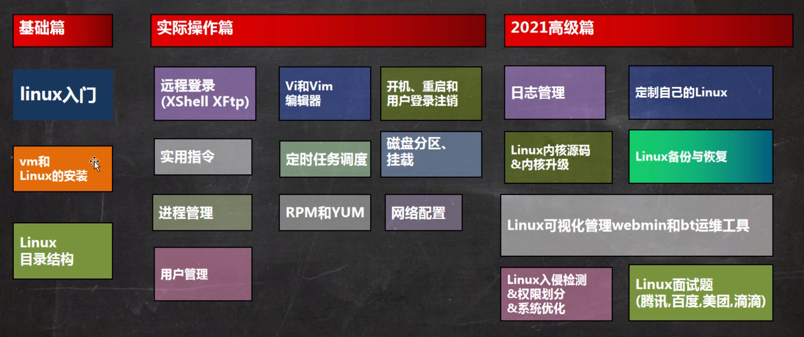

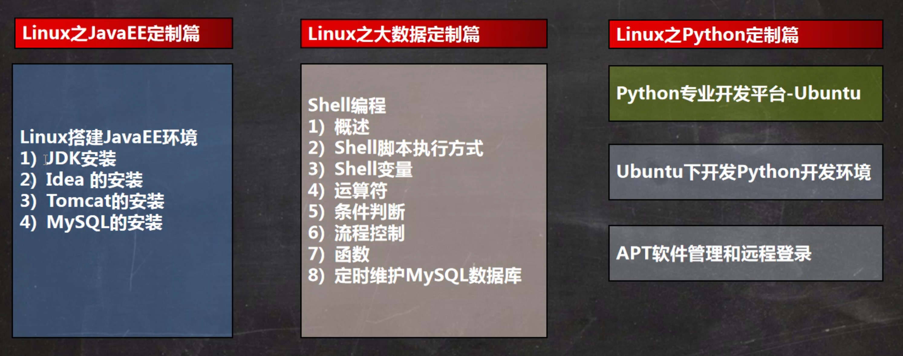

[韩顺平图解Linux课程资料链接](https://pan.baidu.com/s/1j0HVED0vIa7J211QX2UMRg) [提取码](shik)

[韩顺平图解Linux](图解Linux_hsp.pdf)

> [!NOTE]
>
> 写这篇笔记的时候使用的环境是Ubuntu20.04，和韩老师使用的CentOS7.6有些细微区别，但大多数Linux概念是相通的


------


## 1. Linux 应用领域

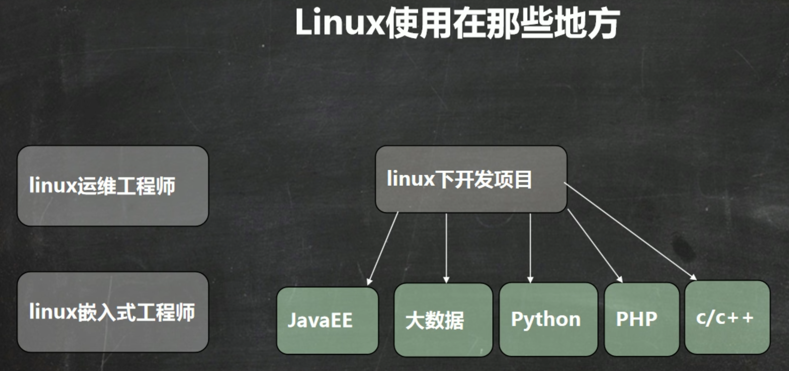

**面向工程师：**

- Linux运维工程师：服务器规划，调试优化，日常监控，故障处理，数据备份和恢复，日志的分析与管理
- Linux嵌入式工程师：驱动开发，在嵌入式系统中进行程序开发

**面向应用：**

- 个人桌面领域是传统 linux 应用薄弱的环节，近些年来随着 ubuntu、fedora 等优秀桌面环境的兴起，linux 在个人桌面领域的占有率在逐渐的提高。
- linux 在服务器领域的应用是最强的，linux 免费、稳定、高效等特点在这里得到了很好的体现，尤其在一些高端领域尤为广泛（c/c++/php/java/python/go）。
- linux 运行稳定、对网络的良好支持性、低成本，且可以根据需要进行软件裁剪，内核最小可以达到几百 KB 等特点， 使其近些年来在嵌入式领域的应用得到非常大的提高。主要应用：机顶盒、数字电视、网络电话、程控交换机、手机、PDA、智能家居、智能硬件等都是其应用领域，以后在物联网中应用会更加广泛。


------


## 2. Linux 入门

### 2.1 概述

​	Linux 是一个开源、免费的操作系统，其稳定性、安全性、处理多并发已经得到业界的认可，目前很多企业级的项目 (c / c++ / php / python / java / go)都会部署到 Linux/unix 系统上。常见的操作系统有：windows、IOS、Android、MacOS, Linux, Unix。

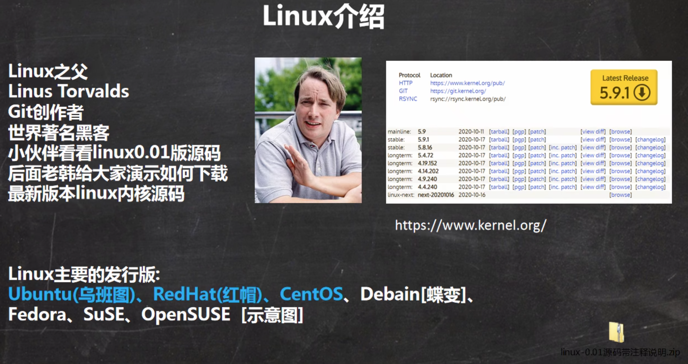

> [!NOTE]
>
> Linux只是一个内核（kernel），不提供上层的操作系统（OS，Operating System）甚至是桌面系统（Desktop System），所以Linux内核和Linux发行版的关系是：Linux发行版是基于开源的Linux内核开发的操作系统和桌面系统。更详细的讲解可以参考[视频](【【硬核科普】Linux根本不是操作系统？终于有人把“内核态”与“用户态”讲明白了！| 进程 / CPU特权模式 / 受限模式 / 系统调用】 https://www.bilibili.com/video/BV1o7PSzZEke/?share_source=copy_web&vd_source=8d1c06c5fb96d5f743cdb6f467e1cd82)，搬运自[视频](https://www.youtube.com/watch?v=ZmPIxfCggFw&t=45s)，下面提供一些图文以供理解：
>
> 首先确定一个概念：操作系统负责连接最上层的用户应用程序软件（Software）和最底层的硬件（Hardware），而内核就是操作系统中负责连接硬件的部分。然后我们继续：
>
> 1. CPU运行有两种模式：特权模式（privileged mode）和受限模式（restricted mode），分别对应两种空间：内核空间（kernel space）和用户空间（user space）；也就是说，用户进程（Process）想要干任何事情，都只能在用户空间向内核发起请求，然后才能由内核对硬件进行操作，显然这避免了众多用户进程直接操控内核这样危险的操作，保证系统安全。其中，系统调用接口是内核最接近用户程序的部分。
>
>    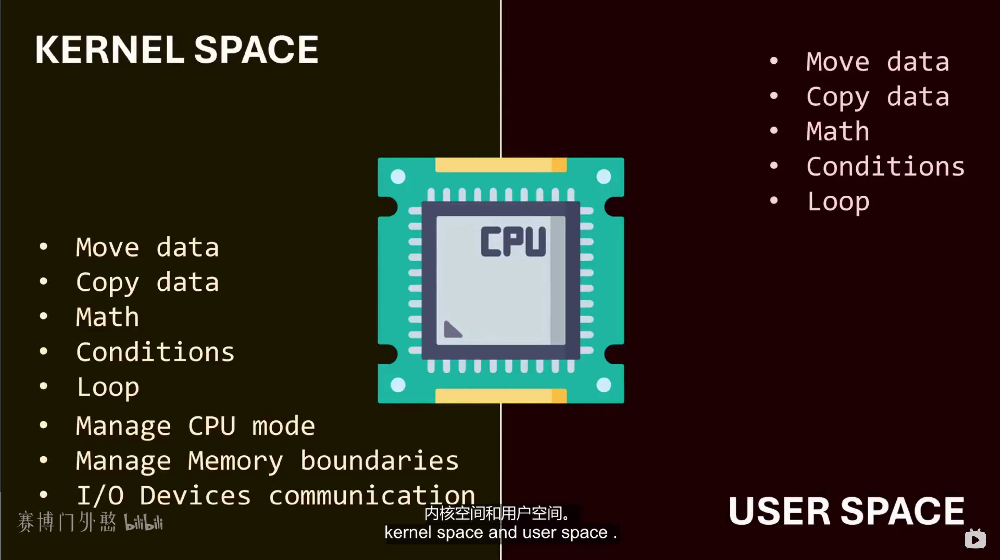
>
>    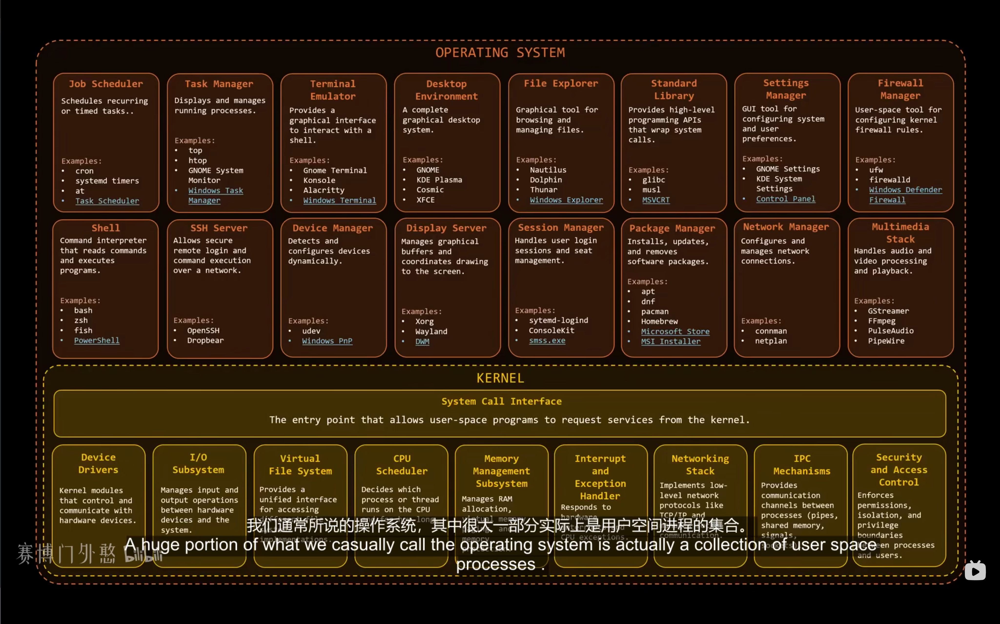
>
>    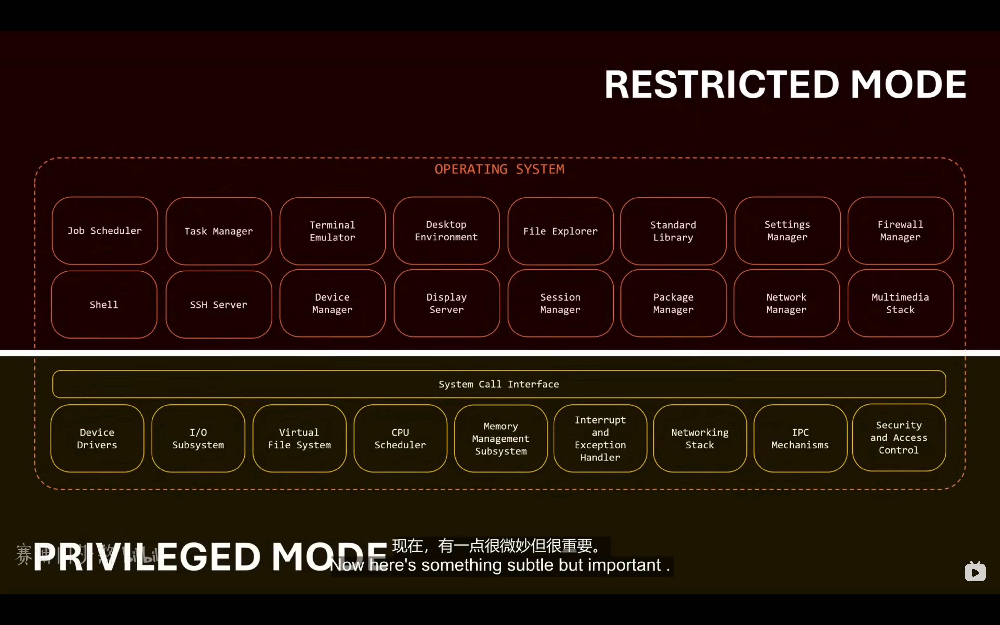
>
>    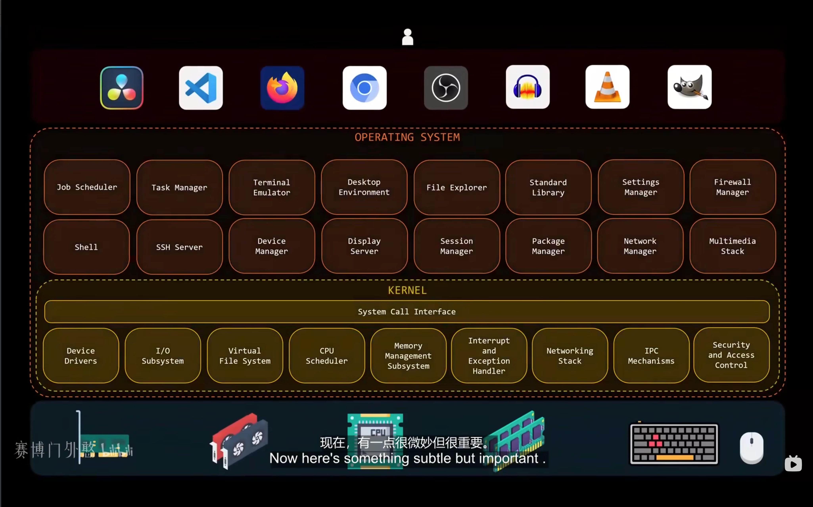
>
> 2. LInux的进程创建哲学是：进程必须先请求操作系统克隆它自己，然后克隆出来的进程再请求操作系统替换为它自己的程序。就是说，用户进程是由其他用户进程所创建的（有点像生物学中所有新细胞都来源于老细胞的生命哲学），意味这从一个子用户进程开始向其父进程开始递归追溯，就会发现所有进程都来自于一个根进程。
>
>    可以通过运行命令来查看进程树
>
>    ```bash
>    pstree
>    ```
>
>    所以，当我们打开电脑，在尝试以用户的身份执行任何操作前，内核的可执行代码必须被加载到内存中，这个过程被称之为引导（Bootstrapping），在所有关键组件加载完毕并准备就绪后，内核自身会初始化唯一一个用户进程，即初始进程（Init，pid=1)
>
>    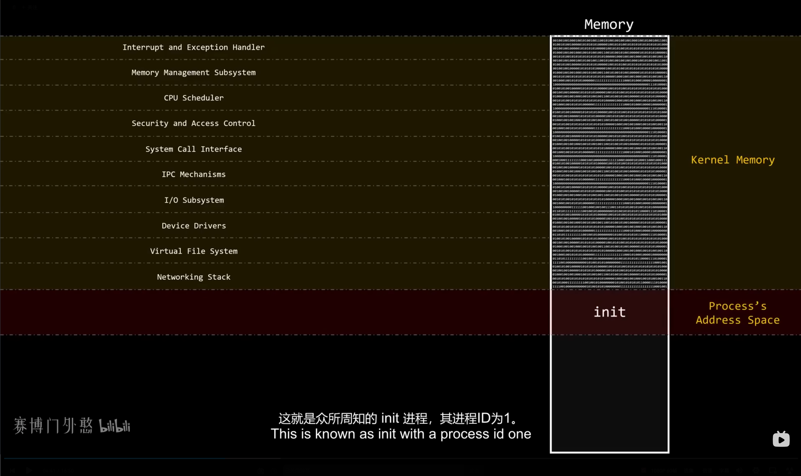
>
>    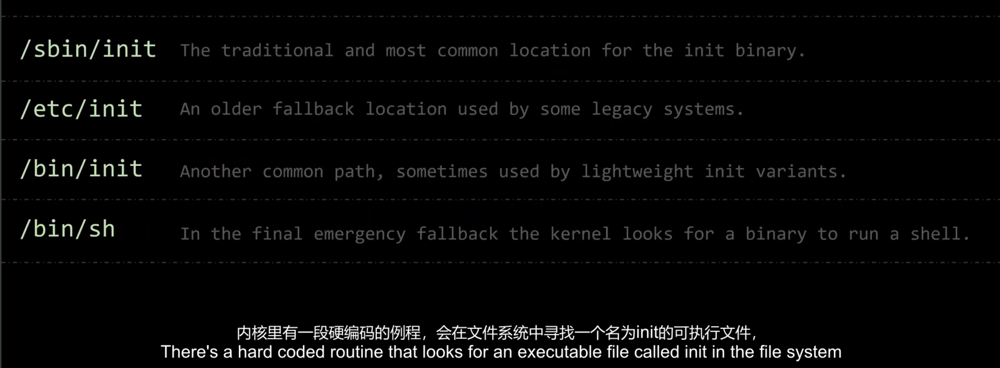
>
>    但事实上，内核设计者也不需要关心这个初始进程是怎样工作的。内核依然会运行可以可执行文件init，但是这个init实际会指向别处的文件来初始化进程，这就是发行版设计者需要关心的问题了，所以初始进程也不属于内核。初始化进程的设计哲学理念也有不同，目前主流的风格有SysVinit.c、OpenRC.c、runit.c、systemd.c，比如Ubuntu：
>
>    ```bash
>    # 执行命令
>    cd /sbin
>    ls -l
>                                           
>    # 可以发现init实际指向了systemd
>    lrwxrwxrwx 1 root root        20 6月  18  2024 init -> /lib/systemd/systemd
>    ```
>
>    对于内核来讲，初始进程是不被允许杀死的，所以许多初始进程的实现也被编写成一种恢复机制，用于恢复关键服务。

### 2.2 Linux 和 Unix 的关系

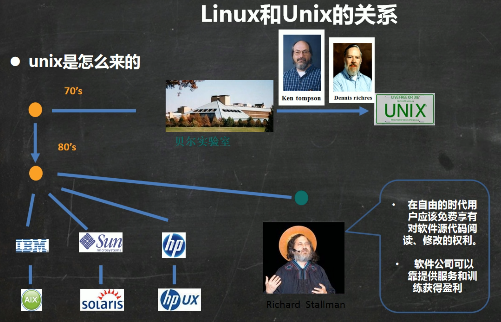

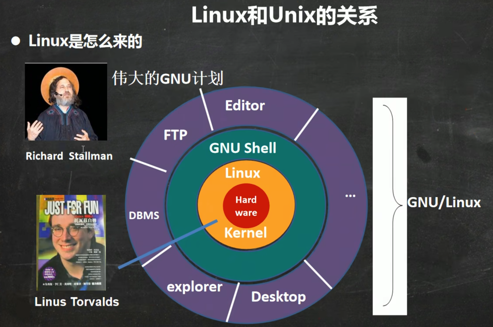

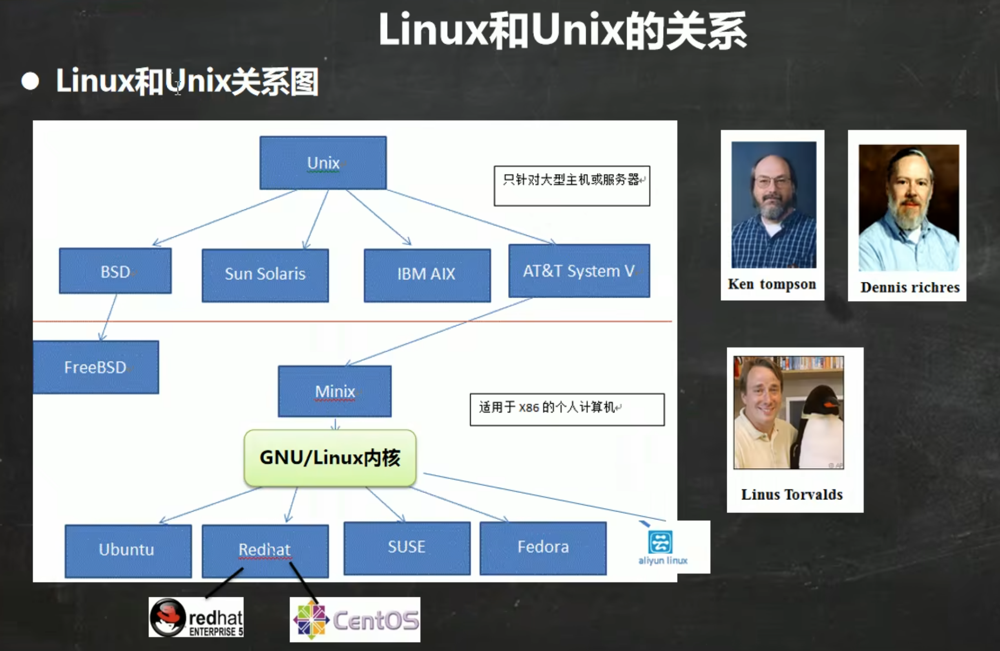


------


## 3. Linux 目录结构

###  3.1 基本结构

Linux 的文件系统是采用级层式的树状目录结构，在此结构中的最上层是根目录`/`，然后在此目录下再创建其他的目录。深刻理解 Linux 树状文件目录是非常重要的！记住 Linux 世界的一句至理名言：**“一切皆文件” (Everything is a file)**

### 3.2 具体目录结构

- `/bin`：（`/usr/bin` 、`/usr/local/bin`），`bin`是`Binary`（二进制文件） 的简称, 该目录为命令文件目录，也称为二进制目录。包含了供系统管理员及普通用户使用的重要的linux命令和二进制（可执行）文件，包含shell解释器等；

- `/sbin`：（`/usr/sbin`、`/usr/local/sbin`），`s` 就是 `Super User`（超级用户，也称系统管理员） 的意思，这里存放的是系统管理员使用的系统管理命令及其二进制（可执行）文件；

- `/home` ：该目录用于存放普通用户，永久挂载点。在 Linux 中每个用户都有一个自己的目录，一般该目录名是以用户的账号命名，`~`表示当前用户的宿主目录；

- `/root`：该目录为系统管理员，也称作超级权限者的用户主目录；

- `/lib`（`/usr/lib`、`/usr/local/lib`）：`library`的简称，该目录下存放了各种编程语言库，典型的Linux系统包含了C、C++和FORTRAN语言的库文件。是系统开机所需要最基本的动态连接共享库，其作用类似于 Windows 里的 DLL 文件。几乎所有的应用程序都需要用到这些共享库；

- `/lost+found`：该目录一般情况下是空的，当系统非法关机后，这里就存放了一些文件，在系统启动的过程中`fsck`工具会检查这里，并修复已经损坏的文件系统。有时系统发生问题，会有很多的文件被移到这个目录中，可能会用手工的方法来修复，或者移动文件到原来的位置上；

- `/etc`：源自法语`et cetera`（“等等”的意思），包含所有的系统管理所需要的配置文件和子目录；

- `/usr`：`user`的简称，这是一个非常重要的目录，用户的很多应用程序和文件都放在这个目录下，类似与 Windows 下的`program files` 目录；

- `/boot`：存放的是启动 Linux 时使用的一些核心文件，包括系统的内核文件和引导装载程序文件；

- `/proc`（不能动）：[`Process Information Pseudo Filesystem （进程信息伪文件系统）`](https://blog.csdn.net/sinat_26058371/article/details/86536314)，该目录是一个虚拟的目录，是系统内存的映射，提供一个指向内核数据结构的接口，通过它能够查看和改变各种系统属性；

- `/srv`（不能动）：`service`的简称，该目录用于存放系统提供的各种服务的数据。例如，Web 服务器的文件可以存放在 /srv/www 下，FTP 服务器的文件可以存放在 /srv/ftp 下。/srv 目录结构可以根据具体服务的需求进行自定义；

- `/sys`（不能动）：`system`的简称，该目录是 Linux 内核的 `sysfs` 文件系统的挂载点，用于呈现内核与设备驱动程序、硬件设备、内核模块之间的接口信息。该目录提供了一种统一的方式，让用户和系统管理员能够直接与系统硬件和内核交互。它是内核空间与用户空间之间的桥梁；

- `/tmp`：`temp`的简称，该目录是一个用于存储系统和用户应用程序临时数据的目录。这个目录中的文件通常在系统重启后会被自动清除，也可以通过命令手动清除；

- `/dev`：`device`的简称，该目录中包含了所有Linux系统中使用的外部设备，类似于 windows 的设备管理器，把所有的硬件用文件的形式存储，但是这里并不是放的外部设备的驱动程序，这一点和 Windows, DOS 操作系统不一样，它实际上是一个访问这些外部设备的端口；

- `/media`： 该目录存放自动挂载的硬件（载点都是由系统自动建立和删除的），Linux 系统会自动识别一些设备，例如 U 盘、光驱等等，当识别后，linux 会把识别的设备挂载到这个目录；

- `/mnt`：`mount`的简称，该目录是为了让用户临时挂载别的存储设备和文件系统，如硬盘、CD-ROM、USB 闪存驱动器等，或者远程文件系统（例如 NFS 文件共享）。当文件系统挂载到 /mnt 目录时，它会映射到 /mnt 下的一个子目录中，用户就可以通过这个子目录访问里面的内容；

- `/opt`：`optional`的简称，该目录是用于安装额外软件包的目录。它是由[`Filesystem Hierarchy Standard (FHS)`](https://en.wikipedia.org/wiki/Filesystem_Hierarchy_Standard)中定义的一种标准文件系统结构。用于放置可选的、独立于发行版的应用程序和软件包。这些软件包不需要使用系统的共享库，并且可以在整个系统中被多个用户使用。通常，这些软件包包含有自己的二进制文件、库、文档等；

- `/var`：`variable`的简称，该目录用于存储在系统运行过程中会动态变化的数据，其内容会随着系统运行、用户操作或应用活动而不断增长、修改或删除。例如，系统日志、Web 服务器文件、数据库数据、邮件队列等均存储于此；一、 什么是用户（User）—— 员工工牌

- `/usr/local`：该目录用于存放主机额外安装的软件，一般是通过编译源码方式安装的程序；

- `selinux`：`security-enhanced linux`的简称，这是一种安全子系统,它能控制程序只能访问特定文件, 有三种工作模式，可以自行设置。

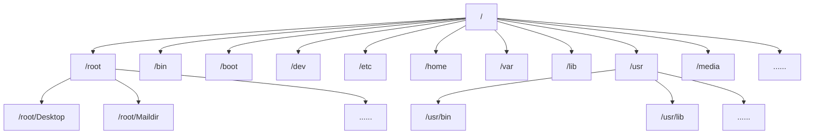
```mermaid
graph TD
    A["/"]
    A --> B["/root"]
    B --> B1["/root/Desktop"]
    B --> B2["/root/Maildir"]
    B --> B3["......"]
    A --> C["/bin"]
    A --> D["/boot"]
    A --> E["/dev"]
    A --> F["/etc"]
    A --> G["/home"]
    A --> H["/var"]
    A --> I["/lib"]
    A --> J["/usr"]
    A --> K["/media"]
    A --> L["......"]
    J --> J1["/usr/bin"]
    J --> J2["/usr/lib"]
    J --> J3["......"]
```

------


## 4. 远程登录到Linux服务器

此部分略，这里是用[`Xshell, Xftp6`](https://www.netsarang.com/en/free-for-home-school/)这两款软件实现的，但是现在有更好的远程连接实现方式[`vscode`](https://blog.csdn.net/weixin_42490414/article/details/117750075?ops_request_misc=elastic_search_misc&request_id=4fd45f43bc99df377855ba5c42231dbd&biz_id=0&utm_medium=distribute.pc_search_result.none-task-blog-2~all~ElasticSearch~search_v2-1-117750075-null-null.142^v102^pc_search_result_base8&utm_term=vscode%20linux%E8%BF%9C%E7%A8%8B&spm=1018.2226.3001.4187)


------


## 5. 使用Vim编辑器

### 5.1 基本介绍

Linux 系统会内置 vi 文本编辑器。 Vim 具有程序编辑的能力，可以看做是 Vi 的增强版本，可以主动的以字体颜色辨别语法的正确性，方便程序设计。代码补完、编译及错误跳转等方便编程的功能特别丰富，在程序员中被广泛使用。

### 5.2 Vim常用的三种模式

1. **正常模式**：以 vim 打开一个档案就直接进入一般模式了(这是默认的模式)。在这个模式中， 你可以使用『上下左右』按键来 移动光标，你可以使用『删除字符』或『删除整行』来处理档案内容， 也可以使用『复制、粘贴』来处理你的文件数据；
2. **插入模式**：按下 i, I, o, O, a, A, r, R 等任何一个字母之后才会进入编辑模式, 一般来说按 i 即可；
3. **命令行模式**：输入 esc 再输入：在这个模式当中， 可以提供你相关指令，完成读取、存盘、替换、离开 vim 、显 示行号等的动作则是在此模式中达成的；

### 5.3 各种模式的项目切换

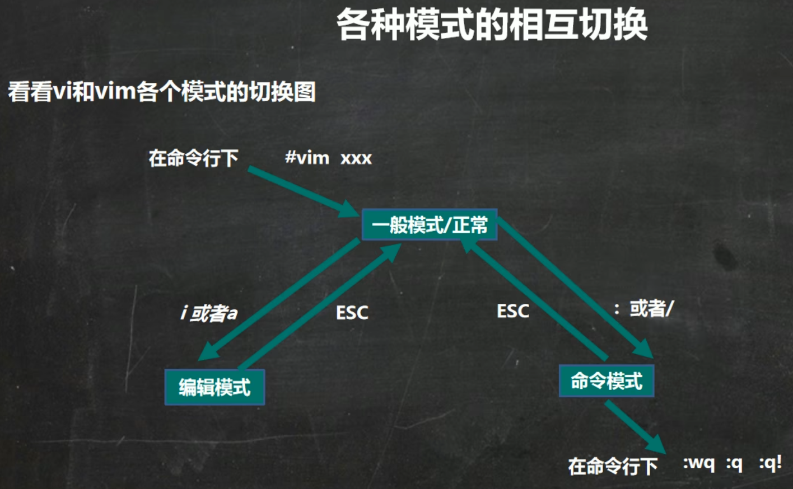

### [5.4 Vim的快捷键](./vim.md)

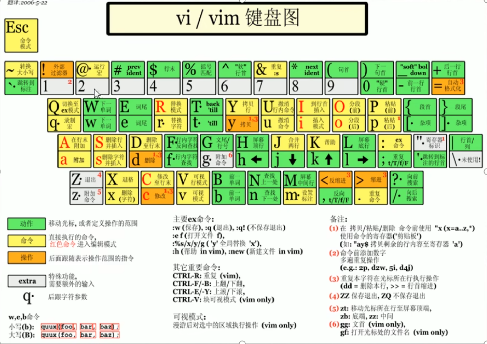


------


## 6. Linux  用户管理

用户和组相关文件：

- `/etc/passwd`：存放用户基本信息，格式：`root:x:0:0:root:/root:/bin/bash`，意思是：`用户名:密码占位符(x):UID:GID:描述:家目录:默认Shell`
- `/etc/shadow`：存放用户的真实密码（经过哈希加密）和密码过期时间，格式：`登录名:加密口令:最后一次修改时间:最小时间间隔:最大时间间隔:警告时间:不活动时间:失效时间:标志`
- `/etc/group`：存放用户组信息，格式：`组名:口令:组标识号:组内用户列表`

### 6.1 关机&重启命令：

```bash
# 立刻关机
shutdown -h now

# n分钟之后关机
shutdown -h n 

# 立即重启
shutdown -r now

# n分钟之后重启
shutdown -r n

# 关机
halt
poweroff

# 重启
reboot

# 把内存数据同步到磁盘（目前以上相关指令执行前都调用了sync）
sync
```

### 6.2 用户管理：

在解释 Linux 的“用户”和“用户组”概念时，我们可以把 Linux 操作系统想象成一栋**办公大楼（或者一家大公司）**。

因为 Linux 从诞生之初就是一个**多用户**的系统，它允许多个人同时登录并使用这台服务器。为了保证大家互不干扰，且机密文件不被乱看，就衍生出了“用户”和“组”的概念。

我们用“公司”的运作方式来理解它们：

#### 1.  什么是用户（User）—— 员工工牌

**用户，代表的是“身份（Identity）”**：它是系统用来识别“你是谁”以及“你能干什么”的唯一凭证。在 Linux 这家公司里，员工分为三种：

1. **超级管理员（Root） - UID 为 0**
   - **角色**：公司的最高董事长、大楼的超级物业
   - **特权**：拥有至高无上的权力（God Mode）。他可以无视任何规则，打开任何房间的门，查看或删除任何文件。**能力越大，破坏力越大**，所以日常不建议直接用 root 登录，容易“删库跑路”
2. **普通用户（Regular User） - UID 通常 1000 起步**
   - **角色**：普通的打工人（比如刚才你创建的 tom）
   - **特权**：他们有自己专属的工位和抽屉（**家目录 /home/tom**）。他们只能在自己的工位上折腾，或者访问大楼里的公共区域。如果想去改系统核心配置，系统会提示“权限拒绝（Permission denied）”
3. **系统用户（System User） - UID 通常在 1 ~ 999 之间**
   - **角色**：大楼里的“服务机器人”或“外包设备”
   - **特权**：你可能没注意，Linux 里自带了很多你从来没建过的用户，比如 www-data、mysql、sshd。它们是专门给软件（服务）准备的假人。比如 Nginx 网页服务默认以 www-data 身份运行，这样就算黑客攻破了网页，他也只是个普通打工人，拿不到董事长的权限。这是一种**安全隔离机制**。

#### 2. 什么是用户组（Group）—— 部门

**组，代表的是“角色（Role）”或“部门”。**
它的核心作用只有一个：**为了更方便地批量管理权限。**

**为什么需要组？**
假设公司有一个“财务报表”文件夹。如果没有组，你要把访问权限一个个地赋予张三、李四、王五……等50个财务人员。如果张三离职了，你还得专门去把他的权限删掉，极其麻烦。
**有了组以后：**
你只需要创建一个名叫 finance（财务部）的**用户组**，把这50个人拉进这个组，然后直接规定：“这个文件夹，只有 finance 组的人能看” ，以后谁入职/离职，只要把他加入/踢出这个组就行了。高效且优雅！

**关于组的两个核心概念（容易懵的点）：**

每个人可以同时属于多个部门，但在 Linux 里，组分为两种：

1. **主组（Primary Group / 初始组）**每个用户**必须且只能有一个**主组。当你用 adduser tom 创建用户时，Linux 默认会顺手建一个也叫 tom 的组，并把 tom 的主组设为 tom。**意义**：当 tom 新建了一个文件时，这个文件默认就属于 tom 组。
2. **附加组（Secondary Group / 附加组）**一个用户可以有**零个或多个**附加组。比如 tom 表现很好，老板决定给他系统管理的权限。我们就可以用之前提过的命令：adduser tom sudo（把 tom 加入 sudo 这个附加组）。此时 tom 既属于 tom 组，也属于 sudo 组（戴了两条部门袖标）。

#### 3. 相关命令

```bash
# 登录为系统管理员，Ubuntu 为 sudo -i
su - root

# 切换为指定普通用户
su - username
```

```bash
# 登出当前用户
exit 
logout
```

```bash
# 设置指定用户的密码
passwd username
```

```bash
# 设置指定用户的密码
passwd username

# 重置root用户密码，需要在root用户下执行
passed root
```

```bash
# 添加一个新用户在 /home ，也可以 useradd -d 指定目录 username 指定新用户的家目录
useradd username

# 强烈建议新手使用这个！这是一个基于 useradd 的高级脚本（多见于Debian/Ubuntu系列）。它是交互式的，运行后会一步步问你设置密码、全名、电话等，并自动帮你建好Home目录
adduser username
```

```bash
# 仅删除用户
userdel username

# 删除用户和 /home 下的用户目录
userdel -r username
```

```bash
# 添加一个组
groupadd groupname

# 删除一个组
groupdel groupname

# 新增一个用户到指定组
useradd -g groupname username

# 将一个用户添加到指定组
usermod -g groupname username

# Ubuntu/Debian下的常用法，把用户加入到某个附加组并授予 sudo 权限
usermod -aG sudo username
```

```bash
# 查询用户信息
id root
id username

# 只打印当前你的有效用户名
whoami

# 查看当前有哪些用户登录了这台服务器，以及他们是从哪个IP连过来的
who

# 强烈推荐!不仅能看谁在线，还能看到系统的负载（Load Average），以及每个用户正在执行什么命令
w
```


------


## 7. Linux 实用指令

### 7.1 指定运行级别

在 Linux 中，**运行级别（Runlevel）** 决定了系统启动后进入的**工作模式**或**状态**。

为了方便理解，你可以把它想象成 Windows 的**“安全模式”**与**“正常启动”**，或者是汽车的**“档位”**。在不同的档位（运行级别）下，系统启动的服务、挂载的硬件和提供的功能是完全不同的。

了解运行级别非常重要，尤其是在排查故障、节省服务器资源或者破解密码时。

#### 1.  经典的 7 个运行级别（SysVinit 时代）

在传统的 Linux 系统中，运行级别被严格定义为 **0 到 6** 共 7 个数字。虽然现在底层技术变了，但这 7 个数字的概念依然被保留和通用：

- **`0`：关机（Halt）**：系统停机状态。千万别把默认运行级别设为 `0`，否则电脑一开机就会立刻关机
- **`1`：单用户模式（Single user mode）**：类似 Windows 的“带命令提示符的安全模式”。不需要输入密码就能直接进入 root 权限，没有网络，只挂载基本的文件系统。**作用**：主要用于系统维护、修复损坏的文件系统，或者**忘记 root 密码时进来强行改密码**
- **`2`：多用户模式（没有 NFS 网络文件系统）**：比较少用，和 `3` 差不多，只是少了一些网络功能
- **`3`：完全多用户文本模式（Multi-user text mode）**：**核心重点！这是所有 Linux 服务器的默认状态。**系统启动所有的网络和服务，允许多个用户同时登录，但是**没有图形界面（纯黑底白字的命令行）**。最省内存、最稳定
- **`4`：保留，未使用**：留给用户自己定制的级别
- **`5`：图形化多用户模式（Graphical mode）**：**核心重点！这是所有 Linux 桌面版（比如你装了桌面的 Ubuntu）的默认状态。**在级别 `3` 的基础上，多启动了一个 GUI 图形系统（如 `X11/Wayland`），你可以用鼠标操作
- **`6`：重启（Reboot）**：正常重启系统。同样千万不能设为默认，否则机器会无限循环重启

#### 2. 现代 Linux 的演进：Target（systemd 时代）

​	现代的 Linux 发行版（Ubuntu 16.04+、CentOS 7+ 等）早就淘汰了老旧的 `SysVinit `启动程序，换成了更先进的 **`systemd`**。在 `systemd` 中，不再使用“运行级别（runlevel）”这个词，而是改成了 **“目标（Target）”**。不过为了照顾老用户的习惯，数字和单词是对应起来的：

- **运行级别 `3`** 变成了 👉 **`multi-user.target`** （多用户命令行目标）
- **运行级别 `5`** 变成了 👉 **`graphical.target`** （图形化目标）
- **运行级别 `1`** 变成了 👉 **`rescue.target`** （救援目标）

#### 3.  怎么查看和切换运行级别？

你可以随时在你的 Ubuntu 上敲这些命令来体验：

> [!WARNING]
>
> 切换级别可能会导致当前图形界面消失，如果是云服务器则无所谓

1. 查看当前的运行级别

   - **老方法**：

     ```bash
     runlevel
     ```

   - **新方法（推荐）**：

     ```bash
     systemctl get-default
     ```

2. 临时切换运行级别（立即生效，重启后失效）

   假设你在用带桌面的 Ubuntu，觉得太卡了，想临时关掉桌面，变成纯命令行：

   - **老方法**：

     ```bash
     init 3
     ```

   - **新方法**：

     ```bash
     sudo systemctl isolate multi-user.target
     ```

   想再回到图形界面：

   - **老方法**：

     ```bash
     init 5
     ```

   - **新方法**：

     ```bash
     sudo systemctl isolate graphical.target
     ```

3. 永久修改默认运行级别（重启后依然生效）

   假设你装了一台带桌面的 Ubuntu 服务器，但你以后只想把它当纯服务器用，不想浪费内存去加载桌面：

   - **设置默认开机进命令行**：

     ```bash
     sudo systemctl set-default multi-user.target
     ```

   - **设置默认开机进图形界面**：

     ```bash
     sudo systemctl set-default graphical.target
     ```

> [!NOTE]
>
> **一个有意思的问题：在Ubuntu如何找回root密码？**
>
> 在 Ubuntu（以及绝大多数 Linux 发行版）中找回或重置遗忘的 root 密码，其实就是利用了我们提到的 **单用户模式（或者叫救援模式）**
>
> 这个过程看起来非常像“黑客操作”，但它是系统管理员的必备技能
>
> ⚠️ **先决条件**：你必须拥有这台机器的**物理接触权限**（如果是云服务器或虚拟机，你需要能打开提供商的 **VNC 控制台 / 网页终端**）。只要别人摸不到你的电脑，这个机制就不会带来安全问题；但如果物理机被别人拿到了，他也能用同样的方法改你的密码（除非你加密了硬盘）
>
> 接下来是具体步骤，**建议你先整体看一遍，再实际操作**：
>
> ### 方法：通过修改 GRUB 引导参数直接拿 Shell（最通用、必杀技）
>
> 这个方法跳过了正常的系统启动过程，直接让 Linux 内核丢给你一个具有最高权限的命令行
>
> #### 第 1 步：进入 GRUB 启动菜单
>
> 1. 重启你的 Ubuntu
> 2. 在电脑刚开机、出现主板 Logo 后，**立刻一直按住 `Shift` 键**（在某些系统或虚拟机中是狂按 **`Esc 键`**）
> 3. 成功的话，你会看到一个黑底白字（或紫底白字）的菜单，第一项通常写着 `Ubuntu`，第二项写着 `Advanced options for Ubuntu`
>
> #### 第 2 步：进入编辑模式
>
> 1. 用键盘上下键，停留在第一项 **`Ubuntu`** 上
> 2. 按下键盘上的字母 **`e`**（Edit 的意思）
> 3. 此时屏幕会变成一堆密密麻麻的英文，这是系统启动的配置代码
>
> #### 第 3 步：修改内核启动参数（核心魔法）
>
> 1. 用键盘的上下左右方向键往下找，找到以单词 **`linux`** 开头的那一行（这行通常很长，可能会自动换行）
>
> 2. 在这一行里面，仔细找，找到 **`ro`** 这个词（它的意思是 Read-Only，只读）
>
> 3. 把光标移过去，**把 `ro` 删除掉**，替换成：
>
>    ```text
>    rw init=/bin/bash
>    ```
>
>    (💡 原理：`rw` 让硬盘变得可读可写，`init=/bin/bash` 告诉内核：不要去加载那个复杂的 `systemd` 系统了，直接给我运行一个 bash 终端！)
>
> #### 第 4 步：启动并重置密码
>
> 1. 修改完成后，仔细检查一下有没有拼错
>
> 2. 按下 **`Ctrl + X`** 或者 **`F10`** 保存并启动
>
> 3. 几秒钟后，屏幕上不会出现正常的登录界面，而是直接出现一个纯黑的命令行提示符，大概长这样：`root@(none):/#`
>    **恭喜你，你现在已经是全能的 root 身份了！**
>
> 4. 输入重置密码的命令：
>
>    ```bash
>    passwd root
>    ```
>
>    (如果你想改的是你自己的普通用户密码，比如你之前建的 tom，就输入 passwd tom)
>
> 5. 按照提示输入新密码两次（记住，**输入密码时屏幕依然没有任何显示**，盲打完按回车即可），如果看到 password updated successfully，就说明成功了
>
> #### 第 5 步：安全重启
>
> 因为我们破坏了正常的启动流程，直接用 reboot 命令可能会报错。我们需要强制重启：
>
> 1. 先同步一下数据到硬盘，防止丢失：
>
>    ```bash
>    sync
>    ```
>
> 2. 强制重启系统：
>
>    ```bash
>    exec /sbin/init
>    ```
>
>    (如果这条命令没反应，你也可以直接长按电脑电源键强制关机再开机，因为刚才已经 sync 过了，数据是安全的)
>
> ### 💡 补充：Ubuntu 独有的“傻瓜式”恢复模式
>
> Ubuntu 其实提供了一个稍微简单的界面，但有时不太灵验（如果你之前给 root 设过密码，它可能依然会卡住要你输入密码），可以作为了解：
>
> 1. 同样进入 GRUB 菜单。
>
> 2. 选择 `Advanced options for Ubuntu`，回车。
>
> 3. 选择 `recovery mode`，回车。
>
> 4. 等一会儿，会跳出一个蓝底灰框的菜单，用方向键选择 **`root - Drop to root shell prompt`**，回车。
>
> 5. 此时如果在下面弹出了光标，你就可以直接输入 passwd root 改密码了。但在这个模式下硬盘默认是只读的，在改密码前需要先敲一行代码重新挂载硬盘：
>
>    ```
>    mount -o remount,rw /
>    ```
>
> **总结**：rw init=/bin/bash 是 Linux 界非常经典的救命绝招，不论是 CentOS、Debian 还是 Ubuntu 都通用。

### 7.2 帮助指令

在 Linux 世界里有一句名言：“***不要试图记住所有的命令和参数，只要记住怎么查帮助就行了***”

Linux 的命令成千上万，每个命令又有几十个参数，连内核大神都不可能全记住。熟练使用“帮助指令”，是你从“新手”走向“老鸟”的最关键一步

 Linux 的帮助体系分为**“四大神器”**和一个**“现代外挂”**，从简到繁：

#### 1. 最快捷的备忘录：`--help` 参数

当你大致记得一个命令，但忘了具体参数（比如不知道怎么按时间排序 ls），这是首选

- **用法**：在几乎所有的外部命令后面加上 `--help` 或 `-h`

- **示例**：

  ```bash
  ls --help
  ```

- **特点**：它会直接在终端里吐出一堆说明，告诉你这个命令怎么用、有哪些参数。简单直接，看完就能继续敲命令

#### 2. 最权威的百科全书：man (Manual)

`man` 是 Linux 系统自带的“官方说明书”。如果 `--help` 只是小抄，那 `man` 就是厚厚的字典

- **用法**：`man 命令名字`

- **示例**：

  ```bash
  man useradd
  ```

- **⚠️ 必杀技：如何阅读和退出 `man`（非常重要）**
  很多新手第一次进入 `man` 界面后，会发现按回车没反应，按 `Ctrl+C` 也退不出来，最后只能关闭终端。其实它用的是 `less` 阅读器，你只需要记住这几个按键：**空格键 (Space)**：向下翻一页。**`b`**：向上翻一页（back）。**`/关键字`**：向下搜索某个词（比如你想查 `password`，就输入 `/password `然后回车。按 `n` 找下一个，按 `N` 找上一个）。**`q`**：**退出（Quit）！**（随时按下 `q` 就能回到普通命令行）

#### 3. 专属内部命令的帮助：`help`

这里有一个**经典的坑**：如果你输入 `cd --help` 或者 `man cd`，你会发现系统报错或者给出的不是你想要的结果

- **原理补充**：Linux 的命令分为**“外部命令”**（存在硬盘上的小程序，比如 `ls`,` useradd`）和**“内部命令”**（Shell 程序自带的，比如 `cd`, `echo`）

- **解决办法**：对于 `cd` 这种内部命令，你要把 `help` 放在前面。

- **示例**：

  ```bash
  help cd
  ```

#### 4. “我忘了命令叫啥”：`apropos` 和 `whatis`

有时你只记得想干什么，但不记得命令的名字了

1. **`whatis`（这是啥？）**：
   如果你看到一个陌生的命令，不想看长篇大论，只想知道它一句话的功能介绍

   ```bash
   whatis usermod
   # 输出：usermod (8) - modify a user account
   ```

2. **`apropos`（关于某事）**：
   如果你想**搜索功能**。比如你想修改密码，但忘了命令是啥（只记得关键词 `password`）

   ```bash
   apropos password
   # 它会列出所有说明书里带有 password 字眼的命令，你一眼就能发现 passwd 在里面
   ```

#### 5. 现代开发者的终极外挂：`tldr` (强烈推荐！)

`man` 手册虽然权威，但太长了，全是大段的英文，有时候让人抓狂
于是开源社区发明了一个神器叫 **`tldr`**，它的全称是网络流行语 **Too Long; Didn't Read（太长不看）**

- **功能**：你查一个命令，它**只给你展示日常工作中最常用的 5 个例子**，简单粗暴！

- **安装（Ubuntu）**：

  ```bash
  sudo apt update
  sudo apt install tldr
  ```

- **使用**：

  ```bash
  tldr tar
  ```

  它不会给你看长篇大论，而是直接告诉你：

  - 怎么解压一个文件
  - 怎么压缩一个文件
  - 怎么查看压缩包内容

#### 总结与实操建议

遇到不会的命令，最佳的流程是：

1. 先用 **`tldr` ** 看看有没有现成的例子直接抄
2. 没有的话，用 **`--help`** 扫一眼参数
3. 遇到极其复杂的配置（比如修改网络、写定时任务），再用 **`man` ** 仔细研读

你现在可以试着在你的 Ubuntu 上敲一下 `man ls`，练习一下按下` / `搜索关键词，然后按`q `退出，体会一下这种“阅读文档”的感觉

掌握了查帮助的方法，你就具备了自学 Linux 的能力！

### 7.3 文件目录类指令

为了方便记忆,，按**实际工作中的使用场景**分为了五大类，并且为你补充了最实用的参数和**“避坑指南”**

#### 1. 穿梭与观察（“我在哪、去哪里、有什么”）

1. `pwd` (Print Working Directory - 打印工作目录)
   *   **作用**：查看当前你正处于哪个文件夹下
   *   **用法**：直接敲 `pwd`
   *   **实战提示**：当你迷失在深深的目录层级中，或者要写绝对路径的脚本时，先用它确认一下位置

2. `cd` (Change Directory - 切换目录)
   *   **作用**：进入或退出文件夹。
   *   **神级快捷键**：
       *   `cd ~` 或直接 `cd`：瞬间回到你自己的家目录（比如 `/home/tom`）
       *   `cd ..`：返回上一级目录
       *   **`cd -`**：在最近待过的两个目录之间来回切换（类似电视遥控器的“返回”键，超级实用！）

3. `ls` (List - 列出内容)
   *   **作用**：看看当前文件夹里都有什么。
   *   **高频参数组合（必背）**：
       *   `ls -l`：列表模式，显示权限、拥有者、大小、时间等详细信息（很多系统自带简写命令 `ll`，等同于 `ls -l`）
       *   `ls -a`：显示所有文件（包括以 `.` 开头的**隐藏文件**）
       *   `ls -lh`：加了 `-h` (human-readable)，把文件大小从字节变成 KB、MB、GB，让人能看懂。
       *   **终极组合**：`ls -lah`（显示一切，且大小易读）

#### 2. 创造与毁灭（“新建与删除”）

1. `mkdir` (Make Directory - 创建目录)
   *   **作用**：新建一个文件夹
   *   **必学参数**：**`-p`** (parents)，如果你想创建一个多层级的目录 `mkdir a/b/c`，如果 `a` 和 `b` 不存在系统会报错，加上 `-p`（`mkdir -p a/b/c`），系统会连带父目录一起顺手建好

2. `touch` (摸一下)

   - **作用**：新建一个空文件（可以指定文件名后缀）

   *   **用法**：`touch 1.txt`
   *   **隐藏原理**：其实 `touch` 原本的作用是“修改文件的时间戳”，如果文件已存在，你 touch 它一下，它的内容不会变，但它的“最后修改时间”会变成现在。如果不存在，才顺手建个空的

3. `rm` (Remove - 删除)
   *   **作用**：删除文件或目录，**Linux 没有回收站，删了就是永远消失！**
   *   **高频参数**：
       *   删除文件：`rm file.txt`。
       *   删除文件夹：必须加 **`-r`** (recursive 递归)，`rm -r 文件夹名`
       *   强制删除不提示：加 `-f` (force)
       *   **最危险的命令**：`rm -rf /*`（无脑静默删掉系统根目录下的所有东西，即著名的“删库跑路”）

#### 3. 搬运与复制

1. `cp` (Copy - 复制)
   *   **作用**：复制文件或目录
   *   **用法**：`cp 源文件 目标位置`（例如 `cp a.txt /home/tom/`）
   *   **避坑**：复制文件夹时，和 `rm` 一样，**必须加上 `-r` 参数**，否则系统会跳过文件夹报错：`cp -r dir1 dir2`
   *   **实战小技巧**：备份配置文件时常用的手速操作：`cp nginx.conf nginx.conf.bak`

2. `mv` (Move - 移动 / 重命名)

   **作用**：有两种用法

   *   **移动文件**：把文件移到另一个文件夹（`mv 1.txt /tmp/`）
   *   **重命名**：如果在同一个目录下移动，就变成了重命名（`mv old.txt new.txt`）

#### 4. 偷窥与阅读（“查看文件内容”）

1. `cat` (Concatenate - 全文查看)
   *   **作用**：一口气把文件所有内容全吐在屏幕上
   *   **适用场景**：只适合看**小文件**。如果用它看几十万行的日志，你的屏幕会疯狂滚动到停不下来
   *   **实用参数**：`-n`（显示行号）

2. `more` (分页查看 - 老派)
   *   **作用**：一页一页看文件。按空格键翻下一页，按 Enter 翻下一行
   *   **缺点**：只能往下看，不能往回翻。已经被 `less` 淘汰

3. `less` (分页查看 - 现代)
   *   **作用**：功能强大的阅读器（我们前面学的 `man` 手册底层用的就是 `less`）
   *   **用法**：可以使用上下键翻动，用 `/` 搜索。按 `q` 退出
   *   **俗语**：“less is more” （less 功能比 more 强大）。对于大文件，首选 `less`，因为它不会像 `cat` 那样一次性把文件全读进内存，打开极快

4. `head` (看头部)
   *   **作用**：只看文件的前几行（默认前 10 行）
   *   **参数**：`head -n 5 1.txt`（只看前 5 行）

5. `tail` (看尾巴 - 极其重要！)
   *   **作用**：只看文件的最后几行（默认后 10 行）
   *   **灵魂参数**：**`-f`** (follow)
       *   `tail -f xxx.log`：这会一直盯住这个文件。一旦有新的程序往日志里写东西，屏幕上会**实时滚动更新**。这是运维和后端开发每天必用的命令（按 `Ctrl+C` 退出盯着）

#### 5. 进阶与杂项

1. `>` 和 `>>`(输出重定向和追加)

   - **作用**：

     `>`：**覆盖**（overwrite）目标文件。如果文件已存在，会先清空文件内容再写入；如果文件不存在，则创建文件。

     `>>`：**追加**（append）到目标文件末尾。如果文件已存在，新内容会添加在文件尾部，原有内容保持不变；如果文件不存在，则创建文件。

   - **用法**：

     假设当前目录有一个文件 `test.txt`，内容为 `Hello`。

     1. 使用 `>`（覆盖）

     ```bash
     $ echo "World" > test.txt
     $ cat test.txt
     World
     ```

     原本的 `Hello` 被覆盖掉了，只剩下 `World`。

     2. 使用 `>>`（追加）

     ```bash
     $ echo "Hello" > test.txt      # 先写入 Hello
     $ echo "World" >> test.txt
     $ cat test.txt
     Hello
     World
     ```

     `World` 被追加到第二行，原来的 `Hello` 还在。

2. `echo` (回声/打印)

   *   **作用**：你给它什么，它就在屏幕上输出什么（`echo "Hello"`）
   *   **实战意义（重定向）**：它本身没啥用，但配合 **`>` (覆盖)** 或 **`>>` (追加)** 符号就无敌了
       *   `echo "hello" > 1.txt`：直接把 hello 写入文件（原来内容被清空覆盖）
       *   `echo "world" >> 1.txt`：把 world 追加到文件末尾。这是最快的写文件方式，不用打开编辑器

3. `ln` (Link - 链接)
   *   **作用**：创建文件的快捷方式。分硬链接和软链接，这里只记实战中最有用的**软链接（类似 Windows 快捷方式）**
   *   **用法**：加 **`-s`** (symbolic) 参数
       *   `ln -s /真实的/深层/路径/目标文件 /桌面的快捷方式名`
       *   比如：`ln -s /var/log/nginx/access.log ~/web_log`。以后你直接看 `web_log`，其实就是在看真实的日志

4. `history` (历史记录)
   *   **作用**：查看你敲过的所有历史命令
   *   **神级用法**：
       1.  敲 `history` 看到带编号的列表，比如 105 行是刚才敲的长命令。直接输入 **`!105`** 回车，就能重新执行那条命令
       2.  键盘按下 **`Ctrl + R`**：进入历史命令搜索模式。只要输入几个字母，它就会自动补全你之前敲过的命令，极大地节省敲击键盘的时间！

### 7.4 时间日期类指令

在 Linux 中，时间日期相关的命令主要用于**查看、设置系统时间/日期**，以及**显示日历**。最常用的是 `date`、`cal`，以及用于硬件时钟的 `hwclock` 和 systemd 下的 `timedatectl`。

#### 1. `date` – 显示或设置系统日期时间

显示当前日期时间

```bash
date
# 输出示例：Mon May 25 15:30:22 CST 2026
```

自定义输出格式（常用格式符）

```bash
date "+%Y-%m-%d %H:%M:%S"      # 2026-05-25 15:30:22
date "+%A, %B %d, %Y"          # Monday, May 25, 2026
date "+%s"                     # Unix 时间戳（秒）
```

常用格式符：
- `%Y` 年（四位）、`%y` 年（两位）
- `%m` 月（01-12）
- `%d` 日（01-31）
- `%H` 时（00-23）、`%M` 分、`%S` 秒
- `%F` 等价于 `%Y-%m-%d`
- `%T` 等价于 `%H:%M:%S`

设置系统时间（需要 root 权限）

```bash
sudo date -s "2026-05-25 15:30:00"      # 设置具体时间
sudo date -s "+1 day"                   # 相对设置：增加一天
```

#### 2. `cal` – 显示日历

基本用法

```bash
cal                  # 当前月份的日历（高亮当天）
cal 2026             # 整个年份的日历
cal 05 2026          # 2026 年 5 月的日历
cal -3               # 显示上、当、下三个月（前后各一月）
cal -y               # 显示当前年份的日历
cal -j               # 显示儒略日（一年中的第几天）
```

#### 3. `timedatectl` – 现代系统时间管理（systemd）

推荐用于 RHEL/CentOS 7+、Ubuntu 16.04+ 等发行版。

查看所有时间信息

```bash
timedatectl
```
输出包括：本地时间、UTC 时间、RTC 时间、时区、NTP 同步状态等。

常用操作

```bash
timedatectl list-timezones          		 # 列出所有时区
timedatectl set-timezone Asia/Shanghai   	 # 设置时区
timedatectl set-time "2026-05-25 15:30:00"   # 设置时间（需关闭 NTP）
timedatectl set-ntp yes             		 # 开启自动 NTP 同步
```

#### 4. `hwclock` – 硬件时钟（RTC）

硬件时钟（Real Time Clock）独立于系统，在关机时仍运行。

```bash
sudo hwclock --show        # 查看硬件时钟时间
sudo hwclock --set --date "2026-05-25 15:30:00"   # 设置硬件时钟
sudo hwclock --systohc      # 将系统时间写入硬件时钟
sudo hwclock --hctosys      # 将硬件时钟读到系统时间
```

通常系统启动时会从硬件时钟读取时间，关机或同步时也可能反向写入。

#### 5. 时间同步工具（简要）

- **`ntpdate`**（传统）：手动同步一次
  ```bash
  sudo ntpdate pool.ntp.org
  ```
- **`chrony`** / **`ntpd`**：作为守护进程持续同步，精度更高。

### 7.5  查找累指令

在 Linux 中，“查找指令”通常指**查找文件**或**查找文件内容**的命令。最常用的有以下几类：

#### 1. 查找文件

1. `find` – 最强大、最灵活（实时查找）

在指定目录下根据文件名、类型、大小、时间等条件搜索。

```bash
# 按文件名查找（当前目录及子目录）
find . -name "*.txt"                # 区分大小写
find . -iname "*.txt"               # 忽略大小写

# 按类型查找
find /home -type f                  # 普通文件
find /home -type d                  # 目录

# 按大小查找
find /var -size +100M               # 大于 100MB 的文件
find /var -size -1k                 # 小于 1KB 的文件

# 按时间查找
find . -mtime -7                    # 7天内修改过的文件
find . -mtime +7                    # 7天前修改过的文件

# 执行操作（删除、复制等）
find . -name "*.log" -delete        # 删除找到的 .log 文件
find . -name "*.sh" -exec chmod +x {} \;   # 给找到的 .sh 加执行权限
```

2. `locate` – 极速查找（基于数据库）

需要事先用 `updatedb` 更新数据库（通常系统每日自动更新）。

```bash
locate passwd                       # 所有包含 "passwd" 的文件路径
locate -i "*.jpg"                   # 忽略大小写
locate -n 10 "*.conf"               # 只显示前10条
```

> 优点：超快；缺点：不是实时的（新建文件可能搜不到）。

3. `which` – 查找命令的可执行文件路径1. find – 最强大、最灵活（实时查找）

```bash
which ls                            # /usr/bin/ls
which python                        # /usr/bin/python
```

4. `whereis` – 查找命令的二进制、源码、帮助页

```bash
whereis ls                          # ls: /usr/bin/ls /usr/share/man/man1/ls.1.gz
```

5. `type` – 判断命令是内置、外部、别名还是函数

```bash
type cd                             # cd is a shell builtin
type ls                             # ls is aliased to `ls --color=auto`
```

#### 2. 查找文件内容

`grep` – 最常用的文本搜索工具

在文件（或命令输出）中搜索匹配指定模式的行。

```bash
# 基本用法
grep "error" /var/log/syslog        # 在文件中搜索字符串
grep -r "TODO" ~/project            # 递归搜索目录下所有文件
grep -i "warning" log.txt           # 忽略大小写
grep -v "debug" log.txt             # 显示不包含 "debug" 的行（反向匹配）
grep -n "main" *.c                  # 显示行号
grep -E "foo|bar" file.txt          # 使用扩展正则表达式（egrep）

# 从管道读取
dmesg | grep -i usb
ps aux | grep sshd
```

### 7.6 压缩和解压类指令

在 Linux 中，**压缩和解压**是最常用的操作之一。不同后缀名对应不同的压缩算法和工具。最核心的命令是 `tar`（用于打包/解包），常配合 `gzip`/`bzip2`/`xz` 实现压缩。此外还有独立的 `zip`/`unzip` 和 `gzip`/`bzip2` 等。

---

#### 1. `tar` – 打包/解包（最常用）

`tar` 本身只是将多个文件**打包成一个 `.tar` 文件**（体积不变），但可以结合压缩选项实现压缩。

##### 基本语法
```bash
tar [选项] [压缩包名] [要操作的文件/目录]
```

##### 常用选项

| 选项 | 说明                                              |
| ---- | ------------------------------------------------- |
| `-c` | 创建打包文件（compress）                          |
| `-x` | 解包（extract）                                   |
| `-v` | 显示过程（verbose）                               |
| `-f` | 指定文件名（必须放最后，后面跟文件名）            |
| `-z` | 通过 `gzip` 压缩/解压（后缀 `.tar.gz` 或 `.tgz`） |
| `-j` | 通过 `bzip2` 压缩/解压（后缀 `.tar.bz2`）         |
| `-J` | 通过 `xz` 压缩/解压（后缀 `.tar.xz`）             |
| `-C` | 指定解压到的目标目录                              |

##### 常见用法示例

###### 1. 打包但不压缩
```bash
tar -cvf archive.tar /path/to/dir       # 打包成 archive.tar
tar -xvf archive.tar                     # 解包到当前目录
```

###### 2. 打包并用 gzip 压缩（最常用）
```bash
tar -czvf archive.tar.gz /path/to/dir    # 压缩
tar -xzvf archive.tar.gz                 # 解压
# 或解压到指定目录
tar -xzvf archive.tar.gz -C /target/dir
```

###### 3. 打包并用 bzip2 压缩（压缩率更高，速度较慢）
```bash
tar -cjvf archive.tar.bz2 /path/to/dir
tar -xjvf archive.tar.bz2
```

###### 4. 打包并用 xz 压缩（压缩率最高，最慢）
```bash
tar -cJvf archive.tar.xz /path/to/dir
tar -xJvf archive.tar.xz
```

###### 5. 查看压缩包内容（不解压）
```bash
tar -tvf archive.tar.gz      # 列出文件列表
```

---

#### 2. `gzip` / `gunzip` – 单文件压缩

`gzip` 只能压缩**单个文件**（不能直接打包目录），压缩后原文件会被替换为 `.gz` 文件。

```bash
gzip file.txt           # 生成 file.txt.gz，原文件消失
gunzip file.txt.gz      # 解压，恢复 file.txt
gzip -d file.txt.gz     # 等同于 gunzip
gzip -l file.txt.gz     # 查看压缩信息
```

配合 `tar` 使用更常见（见上文 `-z` 选项）。

---

#### 3. `bzip2` / `bunzip2` – 更高压缩率（单文件）

类似 `gzip`，但压缩率更高，速度稍慢。

```bash
bzip2 file.txt          # 生成 file.txt.bz2
bunzip2 file.txt.bz2    # 解压
bzip2 -d file.txt.bz2   # 等效
```

通常也通过 `tar -j` 配合使用。

---

#### 4. `zip` / `unzip` – Windows 兼容格式

与 Windows 的 ZIP 文件完全兼容。

##### 压缩
```bash
zip -r archive.zip /path/to/dir     # 递归压缩目录
zip archive.zip file1 file2         # 压缩多个文件
```

##### 解压
```bash
unzip archive.zip                   # 解压到当前目录
unzip archive.zip -d /target/dir    # 解压到指定目录
unzip -l archive.zip                # 列出内容不解压
```

##### 其他选项
```bash
zip -e archive.zip file     # 加密压缩（会提示输入密码）
unzip -P password archive.zip   # 用密码解压
```

---

#### 5. 其他工具

| 命令            | 说明                                                     |
| --------------- | -------------------------------------------------------- |
| `xz` / `unxz`   | 单文件 `.xz` 压缩，压缩率极高（`tar -J` 使用）           |
| `7z` (p7zip)    | 高压缩率，支持 7z、zip、tar 等多种格式，可能需要额外安装 |
| `rar` / `unrar` | 处理 `.rar` 文件（非原生，需安装 `unrar`）               |

---

#### 6. 快速对照表（根据后缀选择命令）

| 后缀                | 典型命令                              |
| ------------------- | ------------------------------------- |
| `.tar`              | `tar -xvf file.tar`                   |
| `.tar.gz` 或 `.tgz` | `tar -xzvf file.tar.gz`               |
| `.tar.bz2`          | `tar -xjvf file.tar.bz2`              |
| `.tar.xz`           | `tar -xJvf file.tar.xz`               |
| `.gz`               | `gunzip file.gz` 或 `gzip -d file.gz` |
| `.bz2`              | `bunzip2 file.bz2`                    |
| `.xz`               | `unxz file.xz`                        |
| `.zip`              | `unzip file.zip`                      |
| `.7z`               | `7z x file.7z`（需安装 p7zip）        |
| `.rar`              | `unrar x file.rar`（需安装 unrar）    |


------


## 8. Linux 组管理和权限管理

### 8.1 Linux 用户、组和权限的关系

Linux 是一个多用户、多任务的操作系统。不同用户可以同时登录同一台服务器，每个用户又可以属于一个或多个用户组。文件和目录的权限就是围绕“谁能读、谁能写、谁能执行”来设计的。

可以把 Linux 权限理解成三类人：

- **所有者（owner）**：文件是谁创建的，通常谁就是文件所有者。
- **所属组（group）**：文件归属于哪个用户组。
- **其他人（others）**：既不是所有者，也不在所属组里的其他用户。

权限也分三种：

- `r`：read，读取权限。
- `w`：write，写入或修改权限。
- `x`：execute，执行权限。

对文件来说：

- `r` 表示可以查看文件内容。
- `w` 表示可以修改文件内容。
- `x` 表示可以把文件作为程序或脚本执行。

对目录来说：

- `r` 表示可以查看目录中的文件名，例如 `ls`。
- `w` 表示可以在目录中创建、删除、重命名文件。
- `x` 表示可以进入目录，例如 `cd`。

> [!NOTE]
>
> 目录的 `x` 权限非常重要。即使你对目录有 `r` 权限，如果没有 `x` 权限，也无法真正进入目录或访问里面的文件。

### 8.2 查看文件权限

使用 `ls -l` 可以查看文件或目录的详细权限。

```bash
ls -l
```

示例：

```bash
-rw-r--r-- 1 tom dev 1200 Jun 18 10:00 hello.txt
drwxr-xr-x 2 tom dev 4096 Jun 18 10:00 scripts
```

第一列权限可以拆开看：

```bash
-rw-r--r--
```

- 第 1 位：文件类型。
  - `-`：普通文件。
  - `d`：目录。
  - `l`：软链接。
- 第 2-4 位：所有者权限。
- 第 5-7 位：所属组权限。
- 第 8-10 位：其他人权限。

比如：

```bash
-rw-r--r--
```

表示普通文件，所有者可读写，所属组只读，其他人只读。

```bash
drwxr-xr-x
```

表示目录，所有者可读写进入，所属组和其他人可以读取并进入，但不能修改目录内容。

### 8.3 修改文件所有者和所属组

#### 1. `chown` 修改所有者

```bash
sudo chown 新所有者 文件名
```

示例：

```bash
sudo chown tom hello.txt
```

递归修改目录及其内部所有文件：

```bash
sudo chown -R tom /opt/app
```

同时修改所有者和所属组：

```bash
sudo chown tom:dev hello.txt
sudo chown -R tom:dev /opt/app
```

#### 2. `chgrp` 修改所属组

```bash
sudo chgrp 新组名 文件名
```

示例：

```bash
sudo chgrp dev hello.txt
sudo chgrp -R dev /opt/app
```

### 8.4 修改权限 `chmod`

`chmod` 可以用两种方式修改权限：符号方式和数字方式。

#### 1. 符号方式

常用对象：

- `u`：user，所有者。
- `g`：group，所属组。
- `o`：others，其他人。
- `a`：all，所有人。

常用操作：

- `+`：增加权限。
- `-`：移除权限。
- `=`：设置为指定权限。

示例：

```bash
chmod u+x script.sh      # 给所有者增加执行权限
chmod g-w file.txt       # 去掉所属组写权限
chmod o-r file.txt       # 去掉其他人读权限
chmod a+r file.txt       # 所有人增加读权限
chmod u=rwx,g=rx,o= file # 所有者 rwx，组 rx，其他人无权限
```

#### 2. 数字方式

权限数字对应关系：

| 权限 | 数字 |
| ---- | ---- |
| `r`  | 4    |
| `w`  | 2    |
| `x`  | 1    |

组合权限就是数字相加：

| 数字 | 权限 | 含义       |
| ---- | ---- | ---------- |
| 7    | rwx  | 读写执行   |
| 6    | rw-  | 读写       |
| 5    | r-x  | 读和执行   |
| 4    | r--  | 只读       |
| 0    | ---  | 无权限     |

常见用法：

```bash
chmod 755 script.sh      # 所有者 rwx，组和其他人 rx
chmod 644 file.txt       # 所有者 rw，组和其他人 r
chmod 700 private.sh     # 只有所有者有 rwx
chmod -R 755 /opt/app    # 递归修改目录权限
```

实战中最常见的是：

- 普通配置文件：`644`
- 可执行脚本：`755` 或 `700`
- 私钥文件：`600`
- 目录：通常需要 `x` 权限，例如 `755`

### 8.5 特殊权限：SUID、SGID、Sticky Bit

除了 `rwx`，Linux 还有三种特殊权限。

#### 1. SUID

SUID 作用在可执行文件上，表示普通用户执行该文件时，临时拥有文件所有者的权限。

典型例子：

```bash
ls -l /usr/bin/passwd
```

`passwd` 命令需要修改 `/etc/shadow`，普通用户本来没有权限，但通过 SUID 可以临时以 root 权限完成密码修改。

#### 2. SGID

SGID 可以作用在文件或目录上。作用在目录上时，在该目录中新建的文件会继承目录的所属组。

适合团队协作目录：

```bash
sudo chmod g+s /project
```

#### 3. Sticky Bit

Sticky Bit 常用于公共目录，表示用户只能删除自己创建的文件，不能删除别人的文件。

典型例子：

```bash
ls -ld /tmp
```

`/tmp` 通常权限类似：

```bash
drwxrwxrwt
```

最后一位 `t` 就表示 Sticky Bit。


------


## 9. Linux 定时任务调度

### 9.1 `cron` 和 `crontab`

`cron` 是 Linux 中最常用的定时任务服务，适合周期性执行任务，比如每天备份、每小时清理日志、每分钟检查服务状态。

查看 cron 服务状态：

```bash
systemctl status crond     # CentOS/RHEL
systemctl status cron      # Ubuntu/Debian
```

编辑当前用户的定时任务：

```bash
crontab -e
```

查看当前用户的定时任务：

```bash
crontab -l
```

删除当前用户的所有定时任务：

```bash
crontab -r
```

> [!WARNING]
>
> `crontab -r` 会直接删除当前用户的全部定时任务，执行前最好先用 `crontab -l` 备份。

### 9.2 crontab 时间格式

crontab 一行任务的基本格式：

```bash
分 时 日 月 周 命令
```

| 字段 | 范围              | 含义           |
| ---- | ----------------- | -------------- |
| 分   | 0-59              | 第几分钟执行   |
| 时   | 0-23              | 第几小时执行   |
| 日   | 1-31              | 每月第几天     |
| 月   | 1-12              | 第几个月       |
| 周   | 0-7               | 星期几，0/7 都表示周日 |

常见符号：

- `*`：任意时间。
- `,`：多个值，例如 `1,3,5`。
- `-`：范围，例如 `1-5`。
- `*/n`：每隔 n 个单位。

示例：

```bash
* * * * * date >> /tmp/time.log          # 每分钟执行一次
*/5 * * * * echo hello >> /tmp/hello.log # 每 5 分钟执行一次
0 2 * * * /root/backup.sh                # 每天凌晨 2 点执行
30 2 * * 1 /root/weekly.sh               # 每周一 2:30 执行
0 0 1 * * /root/monthly.sh               # 每月 1 日 0 点执行
```

### 9.3 定时任务实战建议

定时任务中最好使用**绝对路径**，不要依赖当前目录或交互式 shell 的环境变量。

例如：

```bash
/usr/bin/tar -czf /backup/etc.tar.gz /etc
```

如果脚本依赖环境变量，可以在脚本开头手动设置：

```bash
#!/bin/bash
PATH=/usr/local/sbin:/usr/local/bin:/usr/sbin:/usr/bin:/sbin:/bin
```

定时任务的输出建议重定向到日志文件：

```bash
0 2 * * * /root/backup.sh >> /var/log/backup.log 2>&1
```

其中：

- `>`：标准输出重定向。
- `2>`：错误输出重定向。
- `2>&1`：把错误输出也合并到标准输出。

### 9.4 `at` 一次性定时任务

`at` 用于只执行一次的计划任务，例如今晚 11 点执行某个脚本。

安装并启动：

```bash
sudo apt install at              # Ubuntu
sudo yum install at              # CentOS
sudo systemctl start atd
sudo systemctl enable atd
```

创建一次性任务：

```bash
at 23:00
at> /root/test.sh
at> <EOT>
```

输入任务后按 `Ctrl+D` 结束。

查看任务队列：

```bash
atq
```

删除任务：

```bash
atrm 任务编号
```


------


## 10. Linux 磁盘分区、挂载

### 10.1 Linux 磁盘命名

Linux 中硬盘、分区、U 盘等设备通常位于 `/dev` 目录下。

常见命名：

- `/dev/sda`：第一块 SCSI/SATA/虚拟磁盘。
- `/dev/sdb`：第二块磁盘。
- `/dev/sda1`：第一块磁盘的第一个分区。
- `/dev/nvme0n1`：NVMe 固态硬盘。
- `/dev/nvme0n1p1`：NVMe 磁盘的第一个分区。

查看磁盘和分区：

```bash
lsblk
lsblk -f
```

查看磁盘使用情况：

```bash
df -h
```

查看目录占用空间：

```bash
du -sh /var/log
```

### 10.2 分区工具

传统分区工具：

```bash
sudo fdisk /dev/sdb
```

常见操作：

- `m`：查看帮助。
- `n`：新建分区。
- `p`：查看分区表。
- `d`：删除分区。
- `w`：保存并退出。
- `q`：不保存退出。

> [!WARNING]
>
> 分区操作会改变磁盘结构，可能导致数据丢失。真实服务器上操作前必须确认磁盘名称，不能把系统盘误当成新磁盘。

### 10.3 格式化文件系统

分区后需要格式化为文件系统，例如 ext4 或 xfs。

```bash
sudo mkfs.ext4 /dev/sdb1
sudo mkfs.xfs /dev/sdb1
```

CentOS 7 默认常用 `xfs`，Ubuntu 中 `ext4` 很常见。

### 10.4 挂载和卸载

创建挂载点：

```bash
sudo mkdir -p /data
```

临时挂载：

```bash
sudo mount /dev/sdb1 /data
```

查看挂载结果：

```bash
df -h
lsblk -f
```

卸载：

```bash
sudo umount /data
# 或
sudo umount /dev/sdb1
```

如果提示设备正忙，可以查看是谁占用：

```bash
lsof /data
fuser -m /data
```

### 10.5 开机自动挂载 `/etc/fstab`

临时挂载重启后会失效。如果希望开机自动挂载，需要修改 `/etc/fstab`。

先查看分区 UUID：

```bash
blkid
```

编辑 `/etc/fstab`：

```bash
sudo vim /etc/fstab
```

示例：

```bash
UUID=xxxx-xxxx /data ext4 defaults 0 2
```

修改后不要立刻重启，先测试：

```bash
sudo mount -a
```

如果没有报错，再用 `df -h` 查看是否挂载成功。

> [!WARNING]
>
> `/etc/fstab` 写错可能导致系统启动异常。修改前建议备份：`sudo cp /etc/fstab /etc/fstab.bak`。


------


## 11. Linux 网络配置

### 11.1 查看网络信息

查看 IP 地址：

```bash
ip addr
ip a
```

查看路由：

```bash
ip route
```

查看 DNS：

```bash
cat /etc/resolv.conf
```

查看主机名：

```bash
hostname
hostnamectl
```

修改主机名：

```bash
sudo hostnamectl set-hostname server01
```

### 11.2 网络连通性测试

测试能否访问目标主机：

```bash
ping 192.168.1.1
ping www.baidu.com
```

查看网络路径：

```bash
traceroute www.baidu.com
tracepath www.baidu.com
```

查看端口是否连通：

```bash
telnet 192.168.1.10 22
nc -vz 192.168.1.10 22
```

查看监听端口：

```bash
ss -tunlp
netstat -tunlp
```

常用参数含义：

- `-t`：TCP。
- `-u`：UDP。
- `-n`：不解析域名，直接显示数字。
- `-l`：只看监听端口。
- `-p`：显示进程。

### 11.3 CentOS 和 Ubuntu 网络配置差异

CentOS 7 常见网卡配置文件：

```bash
/etc/sysconfig/network-scripts/ifcfg-ens33
```

修改后重启网络：

```bash
systemctl restart network
```

Ubuntu 20.04 常用 Netplan，配置文件通常在：

```bash
/etc/netplan/
```

修改后应用：

```bash
sudo netplan apply
```

> [!NOTE]
>
> 课程使用 CentOS 7.6，而本文环境是 Ubuntu 20.04。网络配置文件路径差异较大，但查看网络状态的命令如 `ip addr`、`ping`、`ss` 基本通用。

### 11.4 防火墙基础

CentOS 7 常用 `firewalld`：

```bash
systemctl status firewalld
firewall-cmd --state
firewall-cmd --zone=public --list-ports
firewall-cmd --zone=public --add-port=8080/tcp --permanent
firewall-cmd --reload
```

Ubuntu 常用 `ufw`：

```bash
sudo ufw status
sudo ufw allow 22/tcp
sudo ufw allow 8080/tcp
sudo ufw enable
```


------


## 12. Linux 进程管理

### 12.1 进程基本概念

正在运行的程序叫进程。每个进程都有唯一的 PID。Linux 中第一个用户态进程通常是 `systemd`，PID 为 1。

查看进程：

```bash
ps aux
ps -ef
```

常用组合：

```bash
ps aux | grep sshd
ps -ef | grep nginx
```

查看进程树：

```bash
pstree
pstree -p
```

动态查看系统资源：

```bash
top
htop
```

### 12.2 `ps aux` 常见字段

`ps aux` 输出中常见字段：

- `USER`：进程所属用户。
- `PID`：进程号。
- `%CPU`：CPU 占用率。
- `%MEM`：内存占用率。
- `VSZ`：虚拟内存大小。
- `RSS`：实际物理内存占用。
- `STAT`：进程状态。
- `COMMAND`：启动命令。

常见进程状态：

- `R`：运行中。
- `S`：睡眠。
- `D`：不可中断睡眠，常见于 I/O 等待。
- `Z`：僵尸进程。
- `T`：暂停。

### 12.3 结束进程

按 PID 结束进程：

```bash
kill PID
```

强制结束：

```bash
kill -9 PID
```

按进程名结束：

```bash
killall nginx
pkill nginx
```

> [!NOTE]
>
> `kill -9` 是强制杀死进程，进程没有机会清理临时文件或保存状态。优先使用普通 `kill`，无效时再考虑 `kill -9`。

### 12.4 后台进程管理

把命令放到后台执行：

```bash
command &
```

查看当前 shell 的后台任务：

```bash
jobs
```

把前台任务暂停：

```bash
Ctrl + Z
```

让暂停任务在后台继续：

```bash
bg %任务编号
```

把后台任务调回前台：

```bash
fg %任务编号
```

让命令不受终端退出影响：

```bash
nohup command > output.log 2>&1 &
```


------


## 13. Linux 服务管理

### 13.1 服务和 systemd

服务通常是长期在后台运行的程序，例如 SSH、Nginx、MySQL、cron 等。CentOS 7 和 Ubuntu 20.04 都使用 systemd 管理服务。

常用命令：

```bash
systemctl status 服务名     # 查看服务状态
systemctl start 服务名      # 启动服务
systemctl stop 服务名       # 停止服务
systemctl restart 服务名    # 重启服务
systemctl reload 服务名     # 重新加载配置
systemctl enable 服务名     # 设置开机自启
systemctl disable 服务名    # 取消开机自启
```

示例：

```bash
systemctl status ssh
systemctl restart ssh
systemctl enable ssh
```

CentOS 中 SSH 服务名通常是 `sshd`：

```bash
systemctl status sshd
systemctl restart sshd
```

### 13.2 查看服务列表

查看所有服务单元：

```bash
systemctl list-units --type=service
```

查看开机自启状态：

```bash
systemctl list-unit-files --type=service
```

过滤某个服务：

```bash
systemctl list-unit-files | grep ssh
```

### 13.3 运行级别和 target

传统 Linux 有 7 个运行级别：

| 运行级别 | 含义                 |
| -------- | -------------------- |
| 0        | 关机                 |
| 1        | 单用户模式           |
| 2        | 多用户无网络         |
| 3        | 多用户有网络，命令行 |
| 4        | 保留                 |
| 5        | 图形界面             |
| 6        | 重启                 |

systemd 使用 target 替代运行级别：

| systemd target       | 类似运行级别 |
| -------------------- | ------------ |
| `poweroff.target`    | 0            |
| `rescue.target`      | 1            |
| `multi-user.target`  | 3            |
| `graphical.target`   | 5            |
| `reboot.target`      | 6            |

查看默认 target：

```bash
systemctl get-default
```

设置默认进入命令行模式：

```bash
sudo systemctl set-default multi-user.target
```

设置默认进入图形界面：

```bash
sudo systemctl set-default graphical.target
```

临时切换：

```bash
sudo systemctl isolate multi-user.target
sudo systemctl isolate graphical.target
```


------


## 14. Linux 软件包管理

### 14.1 RPM 包管理

RPM 是 Red Hat 系列发行版的软件包格式，CentOS、RHEL、Fedora 等系统常见。

查询已安装软件包：

```bash
rpm -qa
rpm -qa | grep firefox
```

查询某个软件包是否安装：

```bash
rpm -q firefox
```

查看软件包详细信息：

```bash
rpm -qi firefox
```

查看软件包安装了哪些文件：

```bash
rpm -ql firefox
```

查询某个文件属于哪个软件包：

```bash
rpm -qf /etc/passwd
```

卸载软件包：

```bash
rpm -e firefox
```

强制忽略依赖卸载：

```bash
rpm -e --nodeps 软件包名
```

> [!WARNING]
>
> `--nodeps` 会忽略依赖关系，可能导致其他软件无法正常工作。真实环境中不要轻易使用。

安装 RPM 包：

```bash
rpm -ivh 软件包.rpm
```

参数含义：

- `-i`：install，安装。
- `-v`：verbose，显示详细信息。
- `-h`：hash，用进度条显示安装进度。

### 14.2 YUM 包管理

YUM 可以自动解决 RPM 包依赖关系，是 CentOS 7 中非常常用的软件管理工具。

查询软件：

```bash
yum list | grep firefox
```

安装软件：

```bash
sudo yum install firefox
```

卸载软件：

```bash
sudo yum remove firefox
```

更新软件：

```bash
sudo yum update
```

### 14.3 APT 包管理

Ubuntu/Debian 系列使用 APT。

更新软件源索引：

```bash
sudo apt update
sudo apt-get update
```

安装软件：

```bash
sudo apt install package
sudo apt-get install package
```

卸载软件：

```bash
sudo apt remove package
sudo apt-get remove package
```

彻底卸载并删除配置：

```bash
sudo apt-get remove package --purge
```

搜索软件：

```bash
apt search package
sudo apt-cache search package
```

查看软件信息：

```bash
apt show package
sudo apt-cache show package
```

修复依赖：

```bash
sudo apt-get -f install
```

升级系统软件包：

```bash
sudo apt upgrade
sudo apt-get upgrade
sudo apt-get dist-upgrade
```

查看依赖关系：

```bash
sudo apt-cache depends package
sudo apt-cache rdepends package
```

备份软件源配置：

```bash
sudo cp /etc/apt/sources.list /etc/apt/sources.list.backup
```

> [!NOTE]
>
> CentOS 常用 `rpm/yum/dnf`，Ubuntu 常用 `dpkg/apt`。学习命令时要先确认自己当前使用的发行版。


------


## 15. JavaEE 环境搭建

### 15.1 安装 JDK

课程中以手动安装 JDK 8 为例。一般步骤是：上传压缩包、解压、移动到统一目录、配置环境变量。

创建目录：

```bash
sudo mkdir -p /opt/jdk
```

解压 JDK：

```bash
tar -zxvf jdk-8u261-linux-x64.tar.gz
```

移动到统一安装目录：

```bash
sudo mkdir -p /usr/local/java
sudo mv jdk1.8.0_261 /usr/local/java/
```

编辑环境变量：

```bash
sudo vim /etc/profile
```

添加：

```bash
export JAVA_HOME=/usr/local/java/jdk1.8.0_261
export PATH=$JAVA_HOME/bin:$PATH
```

让配置生效：

```bash
source /etc/profile
```

验证：

```bash
java -version
javac -version
```

### 15.2 安装 Tomcat

创建目录并解压：

```bash
sudo mkdir -p /opt/tomcat
tar -zxvf apache-tomcat-*.tar.gz
```

进入 `bin` 目录启动：

```bash
cd apache-tomcat-*/bin
./startup.sh
```

停止 Tomcat：

```bash
./shutdown.sh
```

默认端口是 `8080`，如果无法访问，需要检查防火墙和云服务器安全组。

CentOS 开放端口：

```bash
firewall-cmd --zone=public --add-port=8080/tcp --permanent
firewall-cmd --reload
```

Ubuntu 开放端口：

```bash
sudo ufw allow 8080/tcp
```


------


## 16. Shell 编程

### 16.1 Shell 是什么

Shell 是用户和 Linux 内核之间的命令解释器。我们在终端输入命令，Shell 负责解释并执行。

常见 Shell：

- `/bin/sh`
- `/bin/bash`
- `/bin/zsh`

查看当前 Shell：

```bash
echo $SHELL
```

查看系统支持的 Shell：

```bash
cat /etc/shells
```

### 16.2 Shell 脚本基本格式

新建脚本：

```bash
vim hello.sh
```

内容：

```bash
#!/bin/bash
echo "hello shell"
```

第一行 `#!/bin/bash` 表示使用 bash 解释器执行脚本。

执行方式一：先加执行权限，再直接运行。

```bash
chmod +x hello.sh
./hello.sh
```

执行方式二：直接使用解释器运行。

```bash
sh hello.sh
bash hello.sh
```

### 16.3 变量

系统变量：

```bash
echo $HOME
echo $PWD
echo $SHELL
echo $USER
```

查看所有变量：

```bash
set
```

自定义变量：

```bash
A=100
echo $A
```

变量定义规则：

- 等号两边不能有空格。
- 变量名通常由字母、数字、下划线组成，不能以数字开头。
- 变量值如果有空格，需要用引号包起来。

删除变量：

```bash
unset A
```

只读变量：

```bash
readonly B=200
```

命令替换：

```bash
DATE=`date`
DATE=$(date)
echo $DATE
```

环境变量：

```bash
export MY_HOME=/opt/app
source /etc/profile
echo $MY_HOME
```

### 16.4 位置参数和预定义变量

脚本 `test.sh`：

```bash
#!/bin/bash
echo "第一个参数: $1"
echo "第二个参数: $2"
echo "所有参数: $*"
echo "所有参数: $@"
echo "参数个数: $#"
```

执行：

```bash
bash test.sh a b c
```

常见变量：

- `$0`：脚本名称。
- `$1` 到 `$9`：第 1 到第 9 个参数。
- `${10}`：第 10 个参数。
- `$*`：所有参数，整体看待。
- `$@`：所有参数，分别看待。
- `$#`：参数个数。
- `$$`：当前进程 PID。
- `$!`：后台运行的最后一个进程 PID。
- `$?`：上一条命令的退出状态，0 表示成功。

### 16.5 运算符

常用算术运算：

```bash
A=$((1 + 2))
B=$[3 * 4]
C=$(expr 5 + 6)
echo $A $B $C
```

注意 `expr` 中运算符两边要有空格，乘号需要转义：

```bash
expr 2 \* 3
```

### 16.6 条件判断

基本格式：

```bash
[ condition ]
```

注意：`[` 和 `]` 内侧都要有空格。

整数比较：

| 条件  | 含义     |
| ----- | -------- |
| `-lt` | 小于     |
| `-le` | 小于等于 |
| `-eq` | 等于     |
| `-gt` | 大于     |
| `-ge` | 大于等于 |
| `-ne` | 不等于   |

示例：

```bash
[ 10 -gt 5 ]
echo $?
```

文件判断：

| 条件 | 含义             |
| ---- | ---------------- |
| `-e` | 文件或目录存在   |
| `-f` | 普通文件存在     |
| `-d` | 目录存在         |
| `-r` | 有读权限         |
| `-w` | 有写权限         |
| `-x` | 有执行权限       |

示例：

```bash
[ -f /etc/passwd ] && echo "exists"
[ -d /home ] && echo "dir exists"
```

### 16.7 分支语句

#### 1. if 语句

```bash
#!/bin/bash
if [ $1 -ge 60 ]
then
    echo "及格"
else
    echo "不及格"
fi
```

多分支：

```bash
if [ $1 -ge 90 ]
then
    echo "优秀"
elif [ $1 -ge 60 ]
then
    echo "及格"
else
    echo "不及格"
fi
```

#### 2. case 语句

```bash
case $1 in
"start")
    echo "启动"
    ;;
"stop")
    echo "停止"
    ;;
*)
    echo "用法: $0 {start|stop}"
    ;;
esac
```

### 16.8 循环语句

#### 1. for in

```bash
for i in 1 2 3 4 5
do
    echo $i
done
```

遍历参数：

```bash
for arg in "$@"
do
    echo $arg
done
```

#### 2. C 风格 for

```bash
for (( i=1; i<=5; i++ ))
do
    echo $i
done
```

#### 3. while

```bash
i=1
while [ $i -le 5 ]
do
    echo $i
    i=$((i + 1))
done
```

### 16.9 read 读取输入

```bash
read -p "请输入姓名: " NAME
echo "hello $NAME"
```

设置超时时间：

```bash
read -t 10 -p "请在 10 秒内输入: " VALUE
```

### 16.10 函数

系统函数：

```bash
basename /home/tom/a.txt       # a.txt
dirname /home/tom/a.txt        # /home/tom
```

自定义函数：

```bash
#!/bin/bash
function add() {
    SUM=$(($1 + $2))
    echo $SUM
}

RESULT=$(add 10 20)
echo $RESULT
```

### 16.11 数据库备份脚本示例

需求：每天凌晨备份 MySQL 数据库，并删除 10 天前的备份。

```bash
#!/bin/bash
BACKUP=/data/backup/db
DATETIME=$(date +%Y-%m-%d_%H%M%S)
HOST=localhost
DB_USER=root
DB_PW=hspedu100
DATABASE=hspedu

mkdir -p $BACKUP/$DATETIME
mysqldump -u${DB_USER} -p${DB_PW} --host=$HOST $DATABASE | gzip > $BACKUP/$DATETIME/$DATABASE.sql.gz
cd $BACKUP
tar -zcvf $DATETIME.tar.gz $DATETIME
rm -rf $BACKUP/$DATETIME
find $BACKUP -mtime +10 -name "*.tar.gz" -exec rm -f {} \;
```

配置 crontab：

```bash
30 2 * * * /root/mysql_backup.sh >> /var/log/mysql_backup.log 2>&1
```


------


## 17. Ubuntu、Python 与远程登录

### 17.1 Ubuntu 简介

Ubuntu 是基于 Debian 的 GNU/Linux 发行版，桌面体验较好，软件生态丰富。课程后半部分用 Ubuntu 演示 Python 开发环境和 APT 软件管理。

Ubuntu 和 CentOS 的核心 Linux 概念相通，但常见差异有：

| 对比项 | Ubuntu/Debian | CentOS/RHEL |
| ------ | ------------- | ----------- |
| 软件包格式 | `.deb` | `.rpm` |
| 包管理工具 | `apt` / `apt-get` | `yum` / `dnf` |
| SSH 服务名 | `ssh` | `sshd` |
| 防火墙 | `ufw` 较常见 | `firewalld` 较常见 |
| 网络配置 | Netplan | network-scripts / NetworkManager |

### 17.2 root 用户和 sudo

Ubuntu 默认不直接启用 root 登录，日常管理一般使用 `sudo`。

设置 root 密码：

```bash
sudo passwd
```

切换到 root：

```bash
su
```

退出 root：

```bash
exit
```

> [!NOTE]
>
> 实际工作中不建议长期使用 root 用户操作。更推荐使用普通用户登录，需要管理员权限时再使用 `sudo`。

### 17.3 Python 开发基础

Ubuntu 通常自带 Python 3。

查看版本：

```bash
python3 --version
```

进入交互模式：

```bash
python3
```

编写脚本：

```bash
vim hello.py
```

内容：

```python
print("hello python")
```

运行：

```bash
python3 hello.py
```

### 17.4 Ubuntu SSH 远程登录

安装 SSH 服务端：

```bash
sudo apt-get install openssh-server
```

启动或重启 SSH：

```bash
sudo systemctl restart ssh
sudo systemctl status ssh
```

从另一台机器连接：

```bash
ssh 用户名@IP地址
```

示例：

```bash
ssh hspedu@192.168.200.130
```

如果提示主机密钥变化，可以检查本机的 `known_hosts`：

```bash
vim ~/.ssh/known_hosts
```

> [!NOTE]
>
> 课程中提到的 `service sshd restart` 更偏 CentOS 写法。Ubuntu 上服务名通常是 `ssh`，CentOS 上通常是 `sshd`。


------


## 18. 日志管理

### 18.1 常见日志文件

Linux 日志大多放在 `/var/log/` 目录下。

常见日志：

| 日志文件 | 说明 |
| -------- | ---- |
| `/var/log/boot.log` | 系统启动日志 |
| `/var/log/cron` | crond 定时任务日志，CentOS 常见 |
| `/var/log/syslog` | 系统综合日志，Ubuntu 常见 |
| `/var/log/messages` | 系统综合日志，CentOS 常见 |
| `/var/log/secure` | 安全和认证日志，CentOS 常见 |
| `/var/log/auth.log` | 安全和认证日志，Ubuntu 常见 |
| `/var/log/dmesg` | 内核环形缓冲区日志 |
| `/var/log/wtmp` | 登录成功记录，可用 `last` 查看 |
| `/var/log/btmp` | 登录失败记录，可用 `lastb` 查看 |
| `/var/log/lastlog` | 用户最后登录信息，可用 `lastlog` 查看 |

查看日志常用命令：

```bash
less /var/log/syslog
tail -f /var/log/syslog
tail -f /var/log/messages
```

### 18.2 rsyslogd

`rsyslogd` 是常见的系统日志服务。

查看进程：

```bash
ps aux | grep "rsyslog" | grep -v "grep"
```

查看服务：

```bash
systemctl status rsyslog
systemctl list-unit-files | grep rsyslog
```

配置文件：

```bash
/etc/rsyslog.conf
```

日志规则通常由“设备类型 + 日志级别 + 保存位置”组成。

常见设备类型：

- `auth` / `authpriv`：认证相关。
- `cron`：定时任务。
- `kern`：内核。
- `mail`：邮件。
- `user`：用户级日志。
- `local0` 到 `local7`：自定义日志。

常见日志级别从低到高：

- `debug`
- `info`
- `notice`
- `warning`
- `err`
- `crit`
- `alert`
- `emerg`

日志格式通常包括：

- 事件时间。
- 主机名。
- 服务或程序名。
- 具体日志内容。

### 18.3 logrotate 日志轮转

日志文件如果一直增长，会占满磁盘。`logrotate` 用于定期切割、压缩、删除旧日志。

主配置文件：

```bash
/etc/logrotate.conf
```

单独服务配置目录：

```bash
/etc/logrotate.d/
```

常见参数：

| 参数 | 说明 |
| ---- | ---- |
| `daily` | 每天轮转 |
| `weekly` | 每周轮转 |
| `monthly` | 每月轮转 |
| `rotate 4` | 保留 4 份旧日志 |
| `compress` | 压缩旧日志 |
| `missingok` | 日志不存在也不报错 |
| `notifempty` | 空日志不轮转 |
| `dateext` | 使用日期作为后缀 |
| `create mode owner group` | 轮转后创建新日志文件 |
| `sharedscripts` | 多个日志共享脚本 |
| `prerotate` / `postrotate` | 轮转前后执行脚本 |

示例：

```bash
/var/log/myapp/*.log {
    daily
    rotate 7
    compress
    missingok
    notifempty
    dateext
    create 0640 root root
}
```

### 18.4 journalctl

systemd 使用 `journald` 记录日志，可以用 `journalctl` 查看。

常用命令：

```bash
journalctl                         # 查看全部日志
journalctl -n 3                    # 查看最后 3 条
journalctl -f                      # 实时追踪
journalctl -p err                  # 只看错误级别
journalctl --since "19:00" --until "19:10:10"
journalctl -u ssh                  # 查看某个服务日志，Ubuntu
journalctl -u sshd                 # 查看某个服务日志，CentOS
journalctl _PID=1245
journalctl _COMM=sshd
journalctl | grep sshd
```

输出格式：

```bash
journalctl -o verbose
```


------


## 19. 自定义 Linux 系统与内核

### 19.1 Linux 启动流程

Linux 从开机到进入系统，大致流程如下：

1. 硬件自检。
2. BIOS/UEFI 选择启动设备。
3. 加载 MBR 或 EFI 分区中的引导程序。
4. 引导程序加载 Linux 内核。
5. 内核加载 `initramfs`，初始化必要驱动。
6. 启动 PID 为 1 的初始化进程，现代系统通常是 `systemd`。
7. systemd 按 target 启动各类服务。
8. 进入登录界面或图形界面。

常见内核相关文件在 `/boot` 下：

```bash
ls /boot
```

典型文件：

- `vmlinuz-*`：压缩后的 Linux 内核。
- `initramfs-*` 或 `initrd.img-*`：临时根文件系统镜像。
- `grub/` 或 `grub2/`：启动引导配置。

### 19.2 定制小型 Linux 系统思路

课程中通过 CentOS 7.6 演示定制一个小型 Linux 系统。核心思路是：

1. 新增一块磁盘，例如 `/dev/sdb`。
2. 对新磁盘分区，创建 `/boot` 和 `/` 分区。
3. 格式化分区并挂载。
4. 复制内核、initramfs、必要命令和库文件。
5. 安装并配置 bootloader。
6. 使用该磁盘独立启动系统。

这部分更偏底层系统学习，重点是理解 Linux 启动流程和根文件系统组成。

### 19.3 Linux 内核源码

学习内核源码可以帮助理解：

- 进程管理。
- 内存管理。
- 文件系统。
- 设备驱动。
- 网络协议栈。
- 系统调用。

入门时可以从早期版本如 Linux 0.01 开始，因为代码量小，更适合理解核心结构。

现代系统查看内核版本：

```bash
uname -a
uname -r
```

查看 CentOS 内核包信息：

```bash
yum info kernel -q
```

升级 CentOS 内核：

```bash
yum update kernel
```

查看可用内核包：

```bash
yum list kernel -q
```

下载内核源码示例：

```bash
wget https://cdn.kernel.org/pub/linux/kernel/v5.x/linux-5.8.16.tar.gz
tar -zxvf linux-5.8.16.tar.gz
```


------


## 20. 备份与恢复

### 20.1 备份策略

备份不是简单地复制文件，而是一套策略。常见原则：

- 重要数据要定期备份。
- 备份文件不要只放在同一台机器上。
- 需要定期测试恢复流程。
- 数据库最好使用专用备份工具，例如 `mysqldump`。
- 系统配置文件可以用 `tar`、`rsync`、`dump` 等工具备份。

常见备份方式：

```bash
tar -czvf etc-backup.tar.gz /etc
rsync -av /data/ /backup/data/
```

### 20.2 dump 备份

`dump` 可以按文件系统进行备份，支持 0-9 级增量备份。

安装：

```bash
yum -y install dump
yum -y install restore
```

基本语法：

```bash
dump [-cu] [-0123456789] [-f 备份文件名] [-T 日期] 目录或文件系统
```

常用选项：

- `-0` 到 `-9`：备份级别，`0` 是完整备份，其他是增量备份。
- `-f`：指定备份文件。
- `-u`：备份成功后记录到 `/etc/dumpdates`。
- `-j`：使用 bzip2 压缩。
- `-W`：查看哪些文件系统需要备份。

示例：

```bash
dump -0uj -f /opt/boot.bak0.bz2 /boot
dump -1uj -f /opt/boot.bak1.bz2 /boot
dump -W
cat /etc/dumpdates
dump -0j -f /opt/etc.bak.bz2 /etc/
```

### 20.3 restore 恢复

`restore` 用于恢复 `dump` 生成的备份。

常用模式：

| 参数 | 说明 |
| ---- | ---- |
| `-C` | 比较备份和当前文件差异 |
| `-i` | 交互式恢复 |
| `-r` | 还原整个备份 |
| `-t` | 查看备份内容 |
| `-f` | 指定备份文件 |

示例：

```bash
restore -C -f boot.bak1.bz2
restore -t -f boot.bak0.bz2
restore -r -f /opt/boot.bak0.bz2
restore -r -f /opt/boot.bak1.bz2
```

> [!WARNING]
>
> 备份和恢复命令都可能影响大量文件。真实服务器上恢复前要确认目标目录和备份内容，避免覆盖正在使用的数据。


------


## 21. Webmin 和 BT 运维工具

### 21.1 Webmin

Webmin 是一个基于 Web 的 Unix/Linux 系统管理工具，可以通过浏览器管理用户、服务、软件包、防火墙等。

常见操作：

重置 Webmin 密码：

```bash
/usr/libexec/webmin/changepass.pl /etc/webmin root test
```

修改端口：

```bash
vim /etc/webmin/miniserv.conf
```

例如把：

```bash
port=10000
```

改成：

```bash
port=6666
```

启动、停止、重启：

```bash
/etc/webmin/start
/etc/webmin/stop
/etc/webmin/restart
```

CentOS 防火墙开放端口：

```bash
firewall-cmd --zone=public --add-port=6666/tcp --permanent
firewall-cmd --reload
firewall-cmd --zone=public --list-ports
```

### 21.2 宝塔面板 BT

宝塔面板是国内常见的服务器可视化管理工具，可以管理网站、数据库、FTP、SSL、计划任务等。

课程中给出的安装方式：

```bash
yum install -y wget && wget -O install.sh http://download.bt.cn/install/install_6.0.sh && sh install.sh
```

查看默认登录信息：

```bash
bt default
```

> [!NOTE]
>
> Webmin 和 BT 都会暴露 Web 管理入口。真实服务器使用时要注意强密码、防火墙限制、HTTPS、访问来源限制和及时更新。


------


## 22. Linux 面试题整理

### 22.1 日志统计类

从日志中统计访问 IP 并排序：

```bash
cat access.log | awk '{print $1}' | sort | uniq -c | sort -nr | head
```

统计 Nginx 访问最多的前 2 个 IP：

```bash
cat access.log | awk -F " " '{print $1}' | sort | uniq -c | sort -nr | head -2
```

按 `/` 分割并统计：

```bash
cat t.txt | cut -d '/' -f 3 | sort | uniq -c | sort -nr
```

统计 ESTABLISHED 连接来源 IP：

```bash
netstat -an | grep ESTABLISHED | awk -F " " '{print $5}' | cut -d ":" -f 1 | sort | uniq -c | sort -nr
```

### 22.2 网络抓包和端口

抓取指定网卡、主机和端口的数据：

```bash
tcpdump -i ens33 host 192.168.200.1 and port 22 >> /home/tcpdump.log
```

查看端口监听：

```bash
netstat -tunlp
ss -tunlp
```

### 22.3 Nginx 常见模块

常见模块：

- `rewrite`：地址重写。
- `access`：访问控制。
- `ssl`：HTTPS 支持。
- `ngx_http_gzip_module`：gzip 压缩。
- `ngx_http_proxy_module`：反向代理。
- `ngx_http_upstream_module`：负载均衡 upstream。
- `ngx_cache_purge`：缓存清理。

### 22.4 权限和安全设计

Linux 权限设计原则：

- 普通操作不要直接使用 root。
- 需要管理员权限时使用 `sudo`。
- 遵循最小权限原则。
- 重要文件如 `/etc/passwd`、`/etc/shadow`、`/etc/fstab`、`/etc/sudoers` 要重点保护。
- 理解 SUID、SGID、Sticky Bit 等特殊权限。
- 可使用 `chattr` 锁定关键文件。
- 可使用 Tripwire 做文件完整性检查。
- 可使用 `chkrootkit`、Rootkit Hunter 等工具检查 rootkit。

### 22.5 常用排查命令

查看系统资源：

```bash
top
htop
```

查看 I/O：

```bash
iotop
```

查看磁盘：

```bash
df -lh
lsblk
```

查看进程：

```bash
ps aux | grep 进程名
```

查看服务：

```bash
systemctl status 服务名
chkconfig --list
```

### 22.6 Shell 面试小题

判断文件是否存在：

```bash
if [ -f 文件名 ]; then
    echo "文件存在"
fi
```

统计 `/home/test` 下普通文件数量：

```bash
find /home/test -name "*.*" | wc -l
```

统计 `/home/test` 下文件行数：

```bash
find /home/test -name "*.*" | xargs wc -l
```

递归搜索包含 `cat` 的文件名：

```bash
grep -r "cat" /home | cut -d ":" -f 1
```

对第二列求和：

```bash
awk '{sum += $2} END {print sum}' file.txt
```

### 22.7 负载均衡和高可用

常见负载均衡组件：

- Nginx。
- HAProxy。
- LVS。
- Keepalived。

简单理解：

- Nginx/HAProxy 更常用于七层或四层代理。
- LVS 更偏四层高性能负载均衡。
- Keepalived 常用于 VIP 漂移和高可用。

### 22.8 Linux 系统优化方向

常见优化点：

- 使用普通用户登录，管理操作通过 `sudo`。
- 配置时间同步，例如 `ntpdate ntp1.aliyun.com` 或 chrony。
- 配置合适的软件源镜像。
- 设置合理的防火墙策略。
- 调整文件描述符限制。
- 建立监控、日志、告警体系。
- 制定备份和恢复策略。
- 优化 Nginx、Apache、MySQL 等应用服务参数。
- 根据业务需要调整 `/etc/sysctl.conf` 中的内核参数。
- 禁用不必要的服务，减少资源占用和攻击面。

修改文件描述符限制示例：

```bash
ulimit -SHn 65535
```

也可以写入 `/etc/profile` 或系统限制配置中长期生效。
